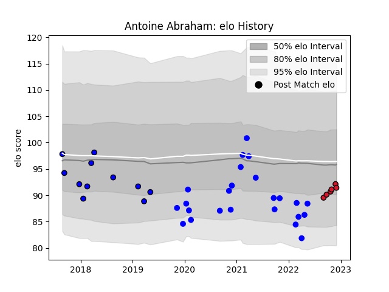

---  
layout: page  
title: Antoine Abraham  
date: 2023-01-13 11:35:17.588182  
categories: player  
---
# Antoine Abraham

## Positions: P

## Current elo: 92.0

## Current Percentile: 30.0

# Elo History

# Match History

| Team    |   Appearances |   Win Rate |
|:--------|--------------:|-----------:|
| Vannes  |            48 |   0.552083 |
| Massy   |            25 |   0.2      |
| Oyonnax |             8 |   1        |

| Opponent           |   Matches |   Win Rate |
|:-------------------|----------:|-----------:|
| Montauban          |         7 |   0.571429 |
| Nevers             |         7 |   0.5      |
| Beziers            |         6 |   0.5      |
| Mont-de-Marsan     |         5 |   0.4      |
| Bayonne            |         5 |   0        |
| Biarritz Olympique |         5 |   0.4      |
| Carcassonne        |         5 |   0.8      |
| Perpignan          |         5 |   0.2      |
| Oyonnax            |         5 |   0.2      |
| Provence Rugby     |         4 |   0.75     |
| US Bressane        |         4 |   0.5      |
| Grenoble           |         4 |   0.25     |
| Colomiers          |         4 |   0.5      |
| Aurillac           |         3 |   1        |
| Rouen              |         3 |   0.333333 |
| Soyaux-Angouleme   |         3 |   0.666667 |
| Brive              |         2 |   0.5      |
| Narbonne           |         1 |   1        |
| Massy              |         1 |   1        |
| Roval Drome XV     |         1 |   1        |
| Agen               |         1 |   1        |