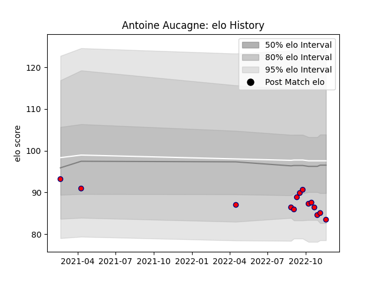

---  
layout: page  
title: Antoine Aucagne  
date: 2023-03-17 17:36:54.779412  
categories: player  
---
# Antoine Aucagne

## Positions: FH

## Current elo: 83.0

## Current Percentile: 14.0

# Elo History

# Match History

| Team     |   Appearances |   Win Rate |
|:---------|--------------:|-----------:|
| Aurillac |            32 |      0.375 |

| Opponent           |   Matches |   Win Rate |
|:-------------------|----------:|-----------:|
| Carcassonne        |         4 |       0.5  |
| Grenoble           |         4 |       0.25 |
| Nevers             |         4 |       0.25 |
| Mont-de-Marsan     |         3 |       0    |
| Beziers            |         2 |       0.5  |
| Massy              |         2 |       1    |
| Oyonnax            |         2 |       0    |
| Provence Rugby     |         2 |       0.5  |
| Vannes             |         2 |       0    |
| Agen               |         1 |       0    |
| Biarritz Olympique |         1 |       0    |
| Colomiers          |         1 |       0    |
| Montauban          |         1 |       1    |
| Rouen              |         1 |       1    |
| Soyaux-Angouleme   |         1 |       1    |
| US Bressane        |         1 |       1    |