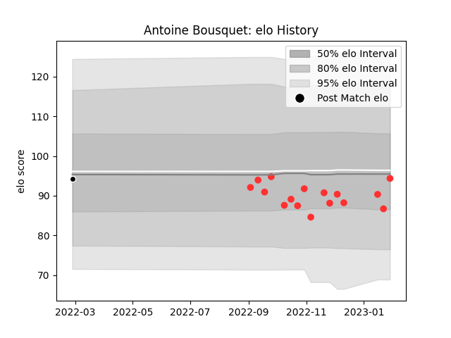

---  
layout: page  
title: Antoine Bousquet  
date: 2023-03-17 17:23:44.880125  
categories: player  
---
# Antoine Bousquet

## Positions: L

## Current elo: 97.0

## Current Percentile: 76.0

# Elo History

# Match History

| Team           |   Appearances |   Win Rate |
|:---------------|--------------:|-----------:|
| Tarbes         |            20 |      0.525 |
| Provence Rugby |             1 |      0     |

| Opponent                   |   Matches |   Win Rate |
|:---------------------------|----------:|-----------:|
| Blagnac                    |         2 |       0.25 |
| Bourgoin-Jallieu           |         2 |       0.5  |
| Carqueiranne-Hyères        |         2 |       0.5  |
| Cognac Saint Jean d'Angély |         2 |       1    |
| Narbonne                   |         2 |       1    |
| Nice                       |         2 |       0.5  |
| Rennes                     |         2 |       1    |
| Albi                       |         1 |       1    |
| Chambery                   |         1 |       0    |
| Dax                        |         1 |       0    |
| Nevers                     |         1 |       0    |
| Suresnes                   |         1 |       0    |
| US Bressane                |         1 |       0    |
| Valence Romans Drome Rugby |         1 |       0    |