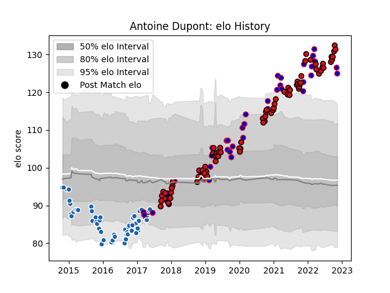

---  
layout: page  
title: Antoine Dupont  
date: 2023-01-06 00:12:36.884352  
categories: player  
---
# Antoine Dupont

## Positions: SH

## Country: France

## Current elo: 139.0

## Current Percentile: 99.0

# Elo History

# Match History

| Team              |   Appearances |   Win Rate |
|:------------------|--------------:|-----------:|
| Stade Toulousain  |            85 |   0.776471 |
| Castres Olympique |            62 |   0.467742 |
| France            |            41 |   0.670732 |

| Opponent             |   Matches |   Win Rate |
|:---------------------|----------:|-----------:|
| Toulon               |        13 |   0.653846 |
| La Rochelle          |        12 |   0.75     |
| Clermont Auvergne    |        12 |   0.708333 |
| Bordeaux Begles      |        10 |   0.8      |
| Stade Francais Paris |         8 |   0.5      |
| Racing 92            |         8 |   0.625    |
| Leinster             |         7 |   0.214286 |
| Montpellier Herault  |         7 |   0.714286 |
| Pau                  |         7 |   0.714286 |
| Brive                |         7 |   0.714286 |
| Italy                |         6 |   1        |
| Scotland             |         6 |   0.5      |
| Castres Olympique    |         6 |   0.5      |
| Wales                |         6 |   0.833333 |
| Stade Toulousain     |         5 |   0.4      |
| Grenoble             |         5 |   0.6      |
| Ireland              |         5 |   0.6      |
| Lyon                 |         5 |   0.6      |
| South Africa         |         4 |   0.25     |
| England              |         4 |   0.5      |
| Sale Sharks          |         4 |   0.5      |
| Bayonne              |         4 |   0.625    |
| Perpignan            |         3 |   1        |
| Agen                 |         3 |   1        |
| Wasps                |         3 |   0.666667 |
| Argentina            |         3 |   1        |
| Cardiff Blues        |         3 |   0.333333 |
| New Zealand          |         2 |   0.5      |
| Northampton Saints   |         2 |   0.5      |
| Oyonnax              |         2 |   0.5      |
| Bath Rugby           |         2 |   1        |
| Biarritz Olympique   |         2 |   1        |
| Connacht             |         1 |   1        |
| Australia            |         1 |   1        |
| Ulster               |         1 |   1        |
| Tonga                |         1 |   1        |
| Exeter Chiefs        |         1 |   0        |
| Dragons              |         1 |   1        |
| Harlequins           |         1 |   0        |
| Fiji                 |         1 |   0        |
| Georgia              |         1 |   1        |
| Gloucester Rugby     |         1 |   1        |
| Munster              |         1 |   1        |
| Japan                |         1 |   0.5      |