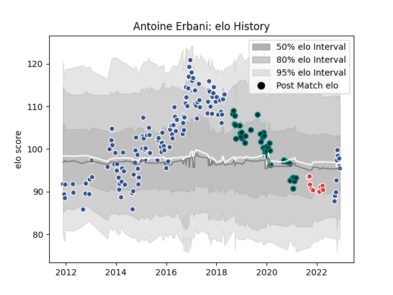

---  
layout: page  
title: Antoine Erbani  
date: 2022-12-12 15:23:18.748853  
categories: player  
---
# Antoine Erbani

## Positions: FL, N8

## Current elo: 95.0

## Current Percentile: 58.0

# Elo History

# Match History

| Team               |   Appearances |   Win Rate |
|:-------------------|--------------:|-----------:|
| Agen               |           131 |    0.51145 |
| Pau                |            40 |    0.45    |
| Biarritz Olympique |            10 |    0.3     |

| Opponent             |   Matches |   Win Rate |
|:---------------------|----------:|-----------:|
| Bordeaux Begles      |        10 |   0.2      |
| Pau                  |         9 |   0.222222 |
| Brive                |         9 |   0.333333 |
| La Rochelle          |         8 |   0.375    |
| Toulon               |         7 |   0.285714 |
| Carcassonne          |         6 |   0.833333 |
| Castres Olympique    |         6 |   0.166667 |
| Oyonnax              |         6 |   0.333333 |
| Mont-de-Marsan       |         6 |   1        |
| Albi                 |         6 |   0.666667 |
| Dax                  |         6 |   0.666667 |
| Montpellier Herault  |         6 |   0.333333 |
| Aurillac             |         6 |   0.666667 |
| Racing 92            |         5 |   0.6      |
| Narbonne             |         5 |   0.6      |
| Stade Francais Paris |         5 |   0.6      |
| Clermont Auvergne    |         5 |   0.2      |
| Bourgoin-Jallieu     |         5 |   0.4      |
| Biarritz Olympique   |         5 |   0.6      |
| Lyon                 |         5 |   0.2      |
| Perpignan            |         4 |   0.5      |
| Colomiers            |         4 |   0.375    |
| Grenoble             |         4 |   0.5      |
| Beziers              |         4 |   0.25     |
| Stade Toulousain     |         3 |   0        |
| Vannes               |         3 |   0.833333 |
| Agen                 |         3 |   1        |
| Worcester Warriors   |         3 |   0.666667 |
| Calvisano            |         3 |   1        |
| Montauban            |         2 |   1        |
| Cardiff Blues        |         2 |   0.5      |
| Sale Sharks          |         2 |   0        |
| Soyaux-Angouleme     |         2 |   0.5      |
| Bucuresti            |         2 |   0.5      |
| Bayonne              |         2 |   1        |
| Tarbes               |         2 |   1        |
| Bath Rugby           |         2 |   0        |
| US Bressane          |         2 |   1        |
| Leicester Tigers     |         2 |   0.5      |
| Ospreys              |         1 |   0        |
| Massy                |         1 |   1        |
| Rouen                |         1 |   1        |
| Auch                 |         1 |   1        |