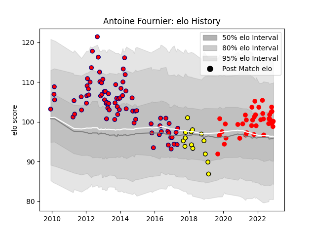

---  
layout: page  
title: Antoine Fournier  
date: 2023-02-02 18:51:43.022354  
categories: player  
---
# Antoine Fournier

## Positions: P

## Current elo: 78.0

## Current Percentile: 6.0

# Elo History

# Match History

| Team        |   Appearances |   Win Rate |
|:------------|--------------:|-----------:|
| Aurillac    |           141 |   0.535461 |
| Rouen       |            71 |   0.34507  |
| Carcassonne |            42 |   0.404762 |

| Opponent                   |   Matches |   Win Rate |
|:---------------------------|----------:|-----------:|
| Beziers                    |        17 |   0.411765 |
| Carcassonne                |        17 |   0.588235 |
| Dax                        |        16 |   0.5625   |
| Narbonne                   |        13 |   0.461538 |
| Colomiers                  |        13 |   0.538462 |
| Mont-de-Marsan             |        12 |   0.416667 |
| Oyonnax                    |        11 |   0.454545 |
| Biarritz Olympique         |        11 |   0.454545 |
| Grenoble                   |        11 |   0.272727 |
| Provence Rugby             |        11 |   0.5      |
| Aurillac                   |        10 |   0.3      |
| Agen                       |         9 |   0.444444 |
| Montauban                  |         9 |   0.333333 |
| Soyaux-Angouleme           |         8 |   0.5      |
| Tarbes                     |         7 |   0.571429 |
| Auch                       |         7 |   0.571429 |
| Pau                        |         6 |   0.166667 |
| Nevers                     |         6 |   0.166667 |
| Perpignan                  |         6 |   0.583333 |
| Massy                      |         6 |   0.833333 |
| Albi                       |         6 |   0.583333 |
| Lyon                       |         6 |   0.333333 |
| La Rochelle                |         6 |   0.333333 |
| Bourgoin-Jallieu           |         6 |   0.5      |
| Bayonne                    |         6 |   0.333333 |
| Vannes                     |         6 |   0.5      |
| US Bressane                |         5 |   0.5      |
| Brive                      |         2 |   0.5      |
| Périgueux                  |         1 |   0        |
| Roval Drome XV             |         1 |   1        |
| Saint-Etienne              |         1 |   1        |
| Bordeaux Begles            |         1 |   1        |
| Valence Romans Drome Rugby |         1 |   0        |