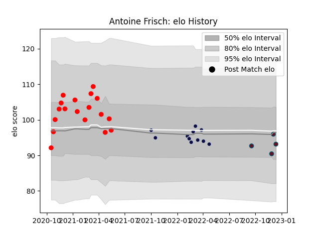

---  
layout: page  
title: Antoine Frisch  
date: 2022-12-14 11:23:55.961716  
categories: player  
---
# Antoine Frisch

## Positions: C

## Current elo: 93.0

## Current Percentile: 48.0

# Elo History

# Match History

| Team          |   Appearances |   Win Rate |
|:--------------|--------------:|-----------:|
| Rouen         |            18 |   0.416667 |
| Bristol Rugby |            11 |   0.363636 |
| Munster       |             4 |   0.5      |

| Opponent                   |   Matches |   Win Rate |
|:---------------------------|----------:|-----------:|
| Aurillac                   |         2 |       0.5  |
| Valence Romans Drome Rugby |         2 |       0.5  |
| Colomiers                  |         2 |       0    |
| Provence Rugby             |         2 |       0.25 |
| Mont-de-Marsan             |         2 |       0    |
| Bath Rugby                 |         2 |       0.5  |
| Newcastle Falcons          |         2 |       0.5  |
| Northampton Saints         |         1 |       0    |
| Wasps                      |         1 |       1    |
| Vannes                     |         1 |       0    |
| Stade Toulousain           |         1 |       0    |
| Soyaux-Angouleme           |         1 |       1    |
| Saracens                   |         1 |       0    |
| Perpignan                  |         1 |       1    |
| Oyonnax                    |         1 |       1    |
| Nevers                     |         1 |       1    |
| London Irish               |         1 |       0    |
| Harlequins                 |         1 |       0    |
| Grenoble                   |         1 |       0    |
| Gloucester Rugby           |         1 |       1    |
| Edinburgh                  |         1 |       1    |
| Connacht                   |         1 |       1    |
| Cardiff Blues              |         1 |       0    |
| Biarritz Olympique         |         1 |       0    |
| Beziers                    |         1 |       1    |
| Worcester Warriors         |         1 |       0    |