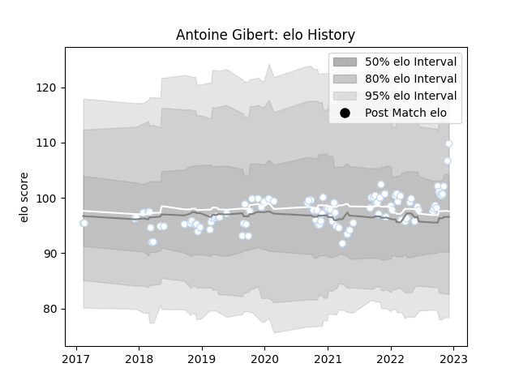

---  
layout: page  
title: Antoine Gibert  
date: 2022-12-14 11:31:44.155059  
categories: player  
---
# Antoine Gibert

## Positions: FH, SH

## Current elo: 110.0

## Current Percentile: 84.0

# Elo History

# Match History

| Team      |   Appearances |   Win Rate |
|:----------|--------------:|-----------:|
| Racing 92 |           104 |      0.625 |

| Opponent             |   Matches |   Win Rate |
|:---------------------|----------:|-----------:|
| Castres Olympique    |        13 |   0.615385 |
| Stade Toulousain     |         8 |   0.25     |
| La Rochelle          |         8 |   0.375    |
| Lyon                 |         8 |   0.625    |
| Montpellier Herault  |         8 |   0.625    |
| Pau                  |         7 |   0.857143 |
| Brive                |         7 |   0.857143 |
| Clermont Auvergne    |         7 |   0.785714 |
| Toulon               |         6 |   0.5      |
| Bordeaux Begles      |         6 |   0.333333 |
| Bayonne              |         5 |   0.4      |
| Stade Francais Paris |         4 |   1        |
| Perpignan            |         4 |   0.75     |
| Agen                 |         4 |   1        |
| Grenoble             |         2 |   1        |
| Leinster             |         2 |   0        |
| Ospreys              |         1 |   1        |
| Munster              |         1 |   0.5      |
| Leicester Tigers     |         1 |   1        |
| Saracens             |         1 |   1        |
| Biarritz Olympique   |         1 |   1        |