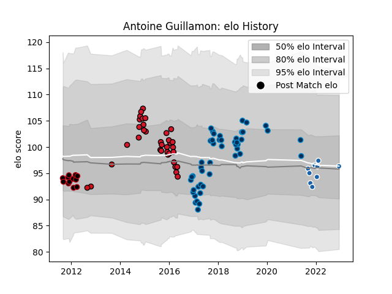

---  
layout: page  
title: Antoine Guillamon  
date: 2022-12-18 16:27:12.886907  
categories: player  
---
# Antoine Guillamon

## Positions: P

## Current elo: 98.0

## Current Percentile: 51.0

# Elo History

# Match History

| Team                |   Appearances |   Win Rate |
|:--------------------|--------------:|-----------:|
| Montpellier Herault |            46 |   0.554348 |
| Oyonnax             |            32 |   0.34375  |
| Lyon                |            12 |   0.291667 |
| Castres Olympique   |            10 |   0.2      |
| Stade Toulousain    |             3 |   1        |

| Opponent             |   Matches |   Win Rate |
|:---------------------|----------:|-----------:|
| Bordeaux Begles      |        10 |   0.65     |
| Toulon               |         8 |   0.625    |
| Stade Francais Paris |         8 |   0.25     |
| Stade Toulousain     |         7 |   0.428571 |
| Brive                |         6 |   0.333333 |
| Castres Olympique    |         5 |   0.3      |
| Clermont Auvergne    |         5 |   0.4      |
| Grenoble             |         5 |   0.4      |
| Lyon                 |         4 |   0        |
| Pau                  |         4 |   0.75     |
| La Rochelle          |         4 |   0.5      |
| Montpellier Herault  |         4 |   0.25     |
| Bayonne              |         3 |   0.666667 |
| Racing 92            |         3 |   0.333333 |
| Agen                 |         3 |   1        |
| Gloucester Rugby     |         3 |   0        |
| Leinster             |         2 |   0        |
| Newcastle Falcons    |         2 |   0        |
| Oyonnax              |         2 |   1        |
| Harlequins           |         2 |   0        |
| Perpignan            |         2 |   1        |
| Exeter Chiefs        |         2 |   0        |
| Edinburgh            |         2 |   0.5      |
| Mont-de-Marsan       |         1 |   1        |
| Leicester Tigers     |         1 |   1        |
| Munster              |         1 |   0        |
| Northampton Saints   |         1 |   1        |
| Saracens             |         1 |   0        |
| Biarritz Olympique   |         1 |   0        |
| Zebre                |         1 |   1        |