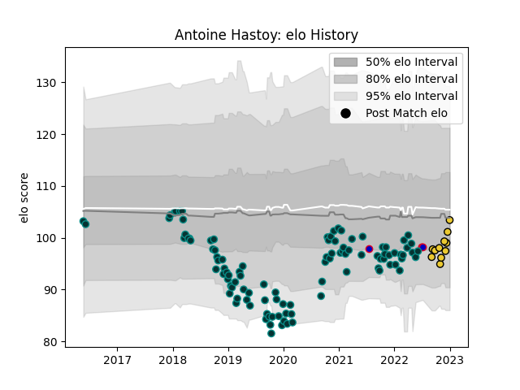

---  
layout: page  
title: Antoine Hastoy  
date: 2022-12-18 16:27:46.291682  
categories: player  
---
# Antoine Hastoy

## Positions: FH

## Country: France

## Current elo: 87.0

## Current Percentile: 12.0

# Elo History

# Match History

| Team        |   Appearances |   Win Rate |
|:------------|--------------:|-----------:|
| Pau         |           103 |   0.417476 |
| La Rochelle |            10 |   0.6      |
| France      |             3 |   0.666667 |

| Opponent             |   Matches |   Win Rate |
|:---------------------|----------:|-----------:|
| Stade Francais Paris |        10 |  0.4       |
| Montpellier Herault  |        10 |  0.5       |
| Brive                |         9 |  0.444444  |
| Lyon                 |         8 |  0.4375    |
| Castres Olympique    |         8 |  0.375     |
| La Rochelle          |         8 |  0.125     |
| Clermont Auvergne    |         7 |  0         |
| Agen                 |         7 |  0.857143  |
| Bordeaux Begles      |         6 |  0.5       |
| Toulon               |         6 |  0.0833333 |
| Stade Toulousain     |         6 |  0.166667  |
| Racing 92            |         5 |  0         |
| Perpignan            |         4 |  1         |
| Bayonne              |         2 |  1         |
| Grenoble             |         2 |  1         |
| Japan                |         2 |  1         |
| Leicester Tigers     |         2 |  0.5       |
| Worcester Warriors   |         2 |  0.5       |
| Biarritz Olympique   |         2 |  1         |
| Ospreys              |         2 |  0.5       |
| Cardiff Blues        |         1 |  0         |
| Ulster               |         1 |  1         |
| Oyonnax              |         1 |  1         |
| Pau                  |         1 |  0         |
| Gloucester Rugby     |         1 |  1         |
| Northampton Saints   |         1 |  1         |
| Australia            |         1 |  0         |
| Zebre                |         1 |  1         |