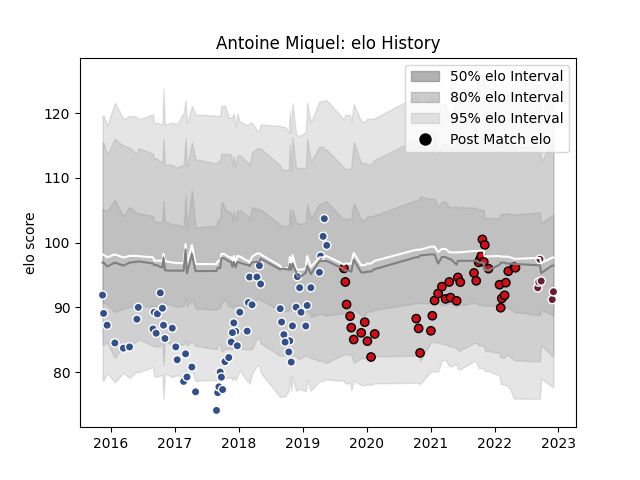

---  
layout: page  
title: Antoine Miquel  
date: 2023-01-06 00:21:39.897126  
categories: player  
---
# Antoine Miquel

## Positions: FL, N8

## Current elo: 121.0

## Current Percentile: 85.0

# Elo History

# Match History

| Team             |   Appearances |   Win Rate |
|:-----------------|--------------:|-----------:|
| Agen             |            74 |   0.466216 |
| Stade Toulousain |            43 |   0.604651 |
| Bordeaux Begles  |             9 |   0.444444 |

| Opponent             |   Matches |   Win Rate |
|:---------------------|----------:|-----------:|
| Montpellier Herault  |        11 |   0.454545 |
| Stade Francais Paris |        10 |   0.3      |
| Bordeaux Begles      |         9 |   0.555556 |
| Racing 92            |         8 |   0.5      |
| Castres Olympique    |         7 |   0.571429 |
| Pau                  |         6 |   0.666667 |
| Perpignan            |         5 |   0.4      |
| La Rochelle          |         5 |   0.6      |
| Brive                |         5 |   0.8      |
| Clermont Auvergne    |         5 |   0.4      |
| Grenoble             |         4 |   0.625    |
| Oyonnax              |         4 |   0.25     |
| Lyon                 |         4 |   0.25     |
| Toulon               |         4 |   0.5      |
| Biarritz Olympique   |         3 |   0.666667 |
| Stade Toulousain     |         3 |   0        |
| Mont-de-Marsan       |         2 |   1        |
| Soyaux-Angouleme     |         2 |   1        |
| Narbonne             |         2 |   0.5      |
| Vannes               |         2 |   0.75     |
| Montauban            |         2 |   1        |
| Agen                 |         2 |   1        |
| Harlequins           |         2 |   0        |
| London Irish         |         2 |   0        |
| Albi                 |         2 |   0.5      |
| Beziers              |         2 |   0        |
| Bayonne              |         2 |   0.5      |
| Aurillac             |         2 |   0.5      |
| Edinburgh            |         1 |   0        |
| Dax                  |         1 |   1        |
| Colomiers            |         1 |   0.5      |
| Cardiff Blues        |         1 |   1        |
| Carcassonne          |         1 |   1        |
| Sharks               |         1 |   0        |
| Bourgoin-Jallieu     |         1 |   1        |
| Benetton Treviso     |         1 |   1        |
| Zebre                |         1 |   1        |