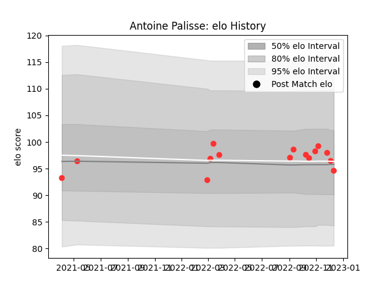

---  
layout: page  
title: Antoine Palisse  
date: 2022-12-14 11:14:37.751547  
categories: player  
---
# Antoine Palisse

## Positions: P

## Current elo: 95.0

## Current Percentile: 52.0

# Elo History

# Match History

| Team   |   Appearances |   Win Rate |
|:-------|--------------:|-----------:|
| Tarbes |            15 |   0.466667 |

| Opponent                   |   Matches |   Win Rate |
|:---------------------------|----------:|-----------:|
| Chambery                   |         2 |        0.5 |
| Cognac Saint Jean d'Angély |         2 |        1   |
| Dax                        |         2 |        0   |
| Aubenas                    |         1 |        1   |
| Blagnac                    |         1 |        1   |
| Bourgoin-Jallieu           |         1 |        1   |
| Carqueiranne-Hyères        |         1 |        0   |
| Narbonne                   |         1 |        1   |
| Nice                       |         1 |        0   |
| Suresnes                   |         1 |        0   |
| US Bressane                |         1 |        0   |
| Valence Romans Drome Rugby |         1 |        0   |