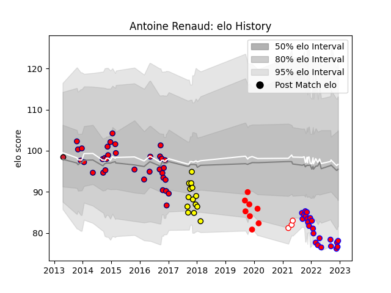

---  
layout: page  
title: Antoine Renaud  
date: 2023-03-21 18:26:22.369959  
categories: player  
---
# Antoine Renaud

Last updated: 2023-03-21
## Positions: FB, FH

## Current elo: 59.0

## Current Percentile: 3.0

# Elo History

# Match History

| Team        |   Appearances |   Win Rate |
|:------------|--------------:|-----------:|
| Aurillac    |            80 |   0.5625   |
| Blagnac     |            37 |   0.567568 |
| Carcassonne |            14 |   0.214286 |
| Rouen       |            10 |   0.3      |
| Dax         |             9 |   0.666667 |
| Oyonnax     |             3 |   0.666667 |

| Opponent                   |   Matches |   Win Rate |
|:---------------------------|----------:|-----------:|
| Dax                        |        11 |   0.545455 |
| Narbonne                   |         9 |   0.5      |
| Bourgoin-Jallieu           |         8 |   0.6875   |
| Beziers                    |         8 |   0.625    |
| Mont-de-Marsan             |         8 |   0.375    |
| Carcassonne                |         7 |   0.714286 |
| Colomiers                  |         7 |   0.571429 |
| Perpignan                  |         6 |   0.583333 |
| Biarritz Olympique         |         6 |   0.666667 |
| Tarbes                     |         6 |   0.75     |
| Massy                      |         6 |   0.333333 |
| Albi                       |         5 |   0.6      |
| Montauban                  |         5 |   0.6      |
| Soyaux-Angouleme           |         4 |   0        |
| Pau                        |         4 |   0.25     |
| Nice                       |         4 |   0.5      |
| US Bressane                |         4 |   0.5      |
| Agen                       |         4 |   0.5      |
| Cognac Saint Jean d'Angély |         4 |   0.25     |
| Chambery                   |         4 |   0.75     |
| Lyon                       |         3 |   0        |
| Valence Romans Drome Rugby |         3 |   0.333333 |
| Aubenas                    |         3 |   1        |
| Oyonnax                    |         3 |   0.333333 |
| Suresnes                   |         3 |   0.666667 |
| La Rochelle                |         2 |   0        |
| Auch                       |         2 |   1        |
| Vannes                     |         2 |   0.5      |
| Bayonne                    |         2 |   1        |
| Nevers                     |         2 |   0.5      |
| Dijon                      |         2 |   0.5      |
| Grenoble                   |         2 |   0        |
| Rennes                     |         1 |   1        |
| Roval Drome XV             |         1 |   1        |
| Aurillac                   |         1 |   0        |
| Provence Rugby             |         1 |   0        |