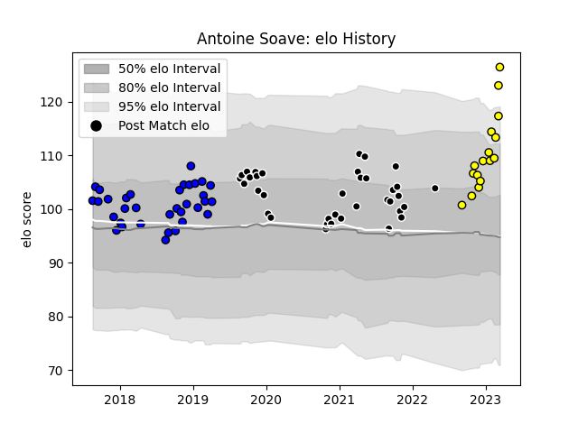

---  
layout: page  
title: Antoine Soave  
date: 2022-12-09 13:07:17.888157  
categories: player  
---
# Antoine Soave

## Positions: P

## Current elo: 102.0

## Current Percentile: 71.0

# Elo History

# Match History

| Team           |   Appearances |   Win Rate |
|:---------------|--------------:|-----------:|
| Massy          |            23 |   0.326087 |
| Provence Rugby |            11 |   0.363636 |
| Albi           |             7 |   0.571429 |

| Opponent                   |   Matches |   Win Rate |
|:---------------------------|----------:|-----------:|
| Aurillac                   |         4 |   0        |
| US Bressane                |         4 |   0.5      |
| Carcassonne                |         4 |   0.5      |
| Montauban                  |         4 |   0.25     |
| Colomiers                  |         3 |   0.333333 |
| Nevers                     |         3 |   0        |
| Provence Rugby             |         2 |   0.5      |
| Dax                        |         2 |   1        |
| Soyaux-Angouleme           |         2 |   0.25     |
| Valence Romans Drome Rugby |         1 |   1        |
| Tarbes                     |         1 |   0        |
| Suresnes                   |         1 |   0        |
| Rouen                      |         1 |   1        |
| Narbonne                   |         1 |   0        |
| Oyonnax                    |         1 |   0        |
| Beziers                    |         1 |   0        |
| Grenoble                   |         1 |   1        |
| Chambery                   |         1 |   1        |
| Brive                      |         1 |   1        |
| Blagnac                    |         1 |   0        |
| Biarritz Olympique         |         1 |   1        |
| Vannes                     |         1 |   0        |