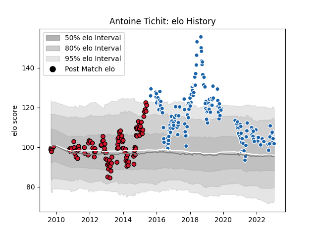

---  
layout: page  
title: Antoine Tichit  
date: 2023-01-17 11:35:36.574108  
categories: player  
---
# Antoine Tichit

## Positions: P

## Current elo: 102.0

## Current Percentile: 71.0

# Elo History

# Match History

| Team              |   Appearances |   Win Rate |
|:------------------|--------------:|-----------:|
| Castres Olympique |           170 |   0.555882 |
| Oyonnax           |           110 |   0.572727 |

| Opponent             |   Matches |   Win Rate |
|:---------------------|----------:|-----------:|
| Stade Toulousain     |        18 |   0.5      |
| Montpellier Herault  |        18 |   0.444444 |
| Toulon               |        17 |   0.411765 |
| Bordeaux Begles      |        17 |   0.5      |
| Pau                  |        16 |   0.75     |
| Brive                |        15 |   0.6      |
| Racing 92            |        15 |   0.6      |
| Stade Francais Paris |        14 |   0.428571 |
| Lyon                 |        14 |   0.785714 |
| Clermont Auvergne    |        14 |   0.5      |
| La Rochelle          |        13 |   0.538462 |
| Bayonne              |        10 |   0.65     |
| Grenoble             |         9 |   0.666667 |
| Agen                 |         7 |   0.714286 |
| Aurillac             |         6 |   0.333333 |
| Albi                 |         5 |   0.4      |
| Provence Rugby       |         5 |   1        |
| Munster              |         5 |   0.3      |
| Biarritz Olympique   |         5 |   0.8      |
| Tarbes               |         5 |   0.8      |
| Perpignan            |         4 |   0.75     |
| Castres Olympique    |         4 |   0.5      |
| Dax                  |         4 |   0.75     |
| Gloucester Rugby     |         3 |   0.333333 |
| Exeter Chiefs        |         3 |   0.333333 |
| Sale Sharks          |         3 |   0        |
| Colomiers            |         3 |   0.166667 |
| Oyonnax              |         3 |   1        |
| Northampton Saints   |         2 |   0.5      |
| Zebre                |         2 |   1        |
| Narbonne             |         2 |   0.5      |
| Mont-de-Marsan       |         2 |   0        |
| Massy                |         2 |   1        |
| Leinster             |         2 |   0.25     |
| Harlequins           |         2 |   0        |
| Carcassonne          |         2 |   0.5      |
| Beziers              |         2 |   1        |
| Lannemezan           |         1 |   1        |
| Saint-Etienne        |         1 |   1        |
| Edinburgh            |         1 |   0        |
| Bourgoin-Jallieu     |         1 |   0        |
| Auch                 |         1 |   1        |
| Worcester Warriors   |         1 |   1        |
| Leicester Tigers     |         1 |   1        |