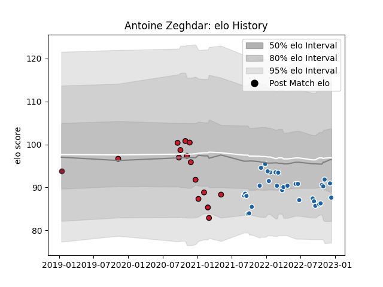

---  
layout: page  
title: Antoine Zeghdar  
date: 2022-12-09 13:05:58.969616  
categories: player  
---
# Antoine Zeghdar

## Positions: C, W

## Current elo: 91.0

## Current Percentile: 36.0

# Elo History

# Match History

| Team              |   Appearances |   Win Rate |
|:------------------|--------------:|-----------:|
| Castres Olympique |            30 |   0.616667 |
| Oyonnax           |            14 |   0.571429 |
| Toulon            |             1 |   0        |

| Opponent             |   Matches |   Win Rate |
|:---------------------|----------:|-----------:|
| Montpellier Herault  |         4 |   0.5      |
| Pau                  |         3 |   1        |
| Clermont Auvergne    |         3 |   1        |
| Stade Francais Paris |         3 |   0.666667 |
| Rouen                |         3 |   0.666667 |
| Racing 92            |         3 |   0.333333 |
| Vannes               |         2 |   0.5      |
| Biarritz Olympique   |         2 |   0.5      |
| Bordeaux Begles      |         2 |   0.25     |
| Toulon               |         2 |   0.5      |
| Stade Toulousain     |         2 |   1        |
| Lyon                 |         2 |   0.5      |
| Perpignan            |         2 |   0.5      |
| Soyaux-Angouleme     |         1 |   1        |
| Provence Rugby       |         1 |   1        |
| Bayonne              |         1 |   1        |
| Munster              |         1 |   0        |
| Beziers              |         1 |   1        |
| Mont-de-Marsan       |         1 |   0.5      |
| Harlequins           |         1 |   0        |
| Grenoble             |         1 |   0        |
| Edinburgh            |         1 |   0        |
| Colomiers            |         1 |   0.5      |
| Brive                |         1 |   0        |
| Montauban            |         1 |   1        |