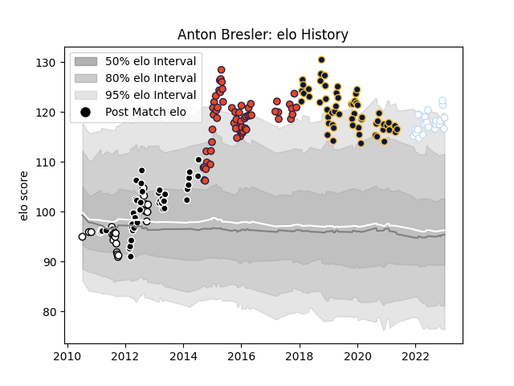

---  
layout: page  
title: Anton Bresler  
date: 2023-01-06 00:08:37.218370  
categories: player  
---
# Anton Bresler

## Positions: L

## Current elo: 127.0

## Current Percentile: 95.0

# Elo History

# Match History

| Team               |   Appearances |   Win Rate |
|:-------------------|--------------:|-----------:|
| Edinburgh          |            61 |   0.5      |
| Worcester Warriors |            57 |   0.385965 |
| Sharks             |            43 |   0.627907 |
| Natal Sharks       |            25 |   0.68     |
| Racing 92          |            21 |   0.642857 |

| Opponent                 |   Matches |   Win Rate |
|:-------------------------|----------:|-----------:|
| London Irish             |         7 |   0.714286 |
| Cheetahs                 |         7 |   0.571429 |
| Exeter Chiefs            |         6 |   0.333333 |
| Dragons                  |         6 |   0.5      |
| Stormers                 |         6 |   0.666667 |
| Gloucester Rugby         |         6 |   0.333333 |
| Harlequins               |         6 |   0.666667 |
| Scarlets                 |         5 |   0.5      |
| Griquas                  |         5 |   0.4      |
| Castres Olympique        |         5 |   0.3      |
| Ospreys                  |         5 |   0.4      |
| Bristol Rugby            |         5 |   0.4      |
| Leicester Tigers         |         5 |   0.6      |
| Leinster                 |         5 |   0.2      |
| Northampton Saints       |         4 |   0        |
| Sale Sharks              |         4 |   0.5      |
| Bath Rugby               |         4 |   0.25     |
| Glasgow Warriors         |         4 |   0.75     |
| Queensland Reds          |         4 |   0.75     |
| Lyon                     |         4 |   0.5      |
| Saracens                 |         4 |   0.5      |
| Zebre                    |         4 |   0.75     |
| Connacht                 |         4 |   0.25     |
| Bulls                    |         4 |   0.5      |
| Western Province         |         4 |   0.75     |
| Benetton Treviso         |         4 |   0.5      |
| Blue Bulls               |         4 |   0.75     |
| Ulster                   |         4 |   0.25     |
| Free State Cheetahs      |         4 |   0.75     |
| Chiefs                   |         4 |   0        |
| Brumbies                 |         3 |   0.666667 |
| Cardiff Blues            |         3 |   0.333333 |
| Bordeaux Begles          |         3 |   0.666667 |
| Leopards                 |         3 |   1        |
| Lions                    |         3 |   0.666667 |
| Western Force            |         3 |   1        |
| Golden Lions             |         3 |   0.333333 |
| Pau                      |         3 |   1        |
| Munster                  |         3 |   0        |
| Wasps                    |         3 |   0        |
| Toulon                   |         2 |   1        |
| Stade Francais Paris     |         2 |   0.5      |
| Pumas                    |         2 |   1        |
| Agen                     |         2 |   1        |
| Newcastle Falcons        |         2 |   0        |
| Blues                    |         2 |   1        |
| London Welsh             |         2 |   1        |
| Brive                    |         2 |   1        |
| Hurricanes               |         2 |   0.5      |
| Highlanders              |         2 |   0.5      |
| Grenoble                 |         2 |   0.5      |
| Crusaders                |         1 |   1        |
| Bayonne                  |         1 |   0        |
| Biarritz Olympique       |         1 |   1        |
| Clermont Auvergne        |         1 |   1        |
| Southern Kings           |         1 |   1        |
| Stade Toulousain         |         1 |   1        |
| New South Wales Waratahs |         1 |   0        |
| Krasny Yar               |         1 |   1        |
| Melbourne Rebels         |         1 |   1        |
| Perpignan                |         1 |   1        |
| Montpellier Herault      |         1 |   0        |
| La Rochelle              |         1 |   0        |