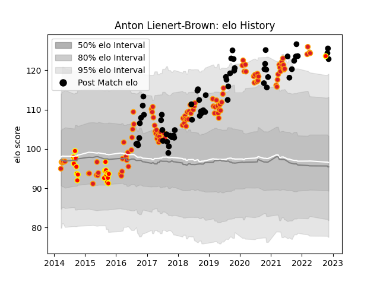

---  
layout: page  
title: Anton Lienert-Brown  
date: 2022-11-15 23:37:00.306006  
categories: player  
---
# Anton Lienert-Brown

## Positions: C

## Country: New Zealand

## Current elo: 123.0

## Current Percentile: 96.0

# Elo History

# Match History

| Team        |   Appearances |   Win Rate |
|:------------|--------------:|-----------:|
| Chiefs      |           101 |   0.589109 |
| New Zealand |            60 |   0.808333 |
| Waikato     |            20 |   0.4      |

| Opponent                 |   Matches |   Win Rate |
|:-------------------------|----------:|-----------:|
| Australia                |        17 |   0.794118 |
| Crusaders                |        16 |   0.375    |
| Blues                    |        15 |   0.633333 |
| Hurricanes               |        14 |   0.464286 |
| Highlanders              |        12 |   0.375    |
| Argentina                |         9 |   0.888889 |
| South Africa             |         8 |   0.6875   |
| Brumbies                 |         5 |   0.6      |
| Queensland Reds          |         5 |   0.8      |
| New South Wales Waratahs |         5 |   0.8      |
| Melbourne Rebels         |         5 |   1        |
| Bulls                    |         4 |   0.875    |
| Stormers                 |         4 |   0.75     |
| Wales                    |         4 |   1        |
| Jaguares                 |         4 |   0.5      |
| France                   |         4 |   1        |
| Ireland                  |         4 |   0.5      |
| Western Force            |         3 |   0.666667 |
| Bay of Plenty            |         3 |   0.666667 |
| British and Irish Lions  |         3 |   0.5      |
| Scotland                 |         2 |   1        |
| Cheetahs                 |         2 |   0.75     |
| Wellington               |         2 |   0.5      |
| Tasman                   |         2 |   0        |
| Sunwolves                |         2 |   1        |
| Canterbury               |         2 |   0        |
| Sharks                   |         2 |   1        |
| Italy                    |         2 |   1        |
| Lions                    |         2 |   0        |
| Counties Manukau         |         2 |   0.5      |
| Manawatu                 |         2 |   0.5      |
| Auckland                 |         2 |   0        |
| Otago                    |         1 |   0        |
| Samoa                    |         1 |   1        |
| North Harbour            |         1 |   1        |
| Namibia                  |         1 |   1        |
| Southern Kings           |         1 |   1        |
| Southland                |         1 |   1        |
| England                  |         1 |   0        |
| Taranaki                 |         1 |   0        |
| Tonga                    |         1 |   1        |
| United States of America |         1 |   1        |
| Japan                    |         1 |   1        |
| Fiji                     |         1 |   1        |
| Hawke's Bay              |         1 |   1        |