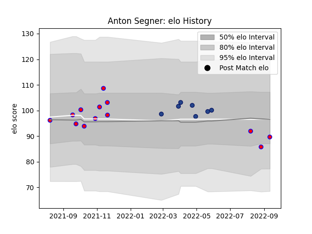

---  
layout: page  
title: Anton Segner  
date: 2023-03-30 11:32:28.494190  
categories: player  
---
# Anton Segner

Last updated: 2023-03-30
## Positions: FL, N8

## Current elo: 90.0

## Current Percentile: 21.0

# Elo History

# Match History

| Team   |   Appearances |   Win Rate |
|:-------|--------------:|-----------:|
| Tasman |            13 |   0.538462 |
| Blues  |             7 |   0.857143 |

| Opponent                 |   Matches |   Win Rate |
|:-------------------------|----------:|-----------:|
| Waikato                  |         3 |        0   |
| Canterbury               |         2 |        0   |
| Hawke's Bay              |         2 |        0.5 |
| Moana Pasifika           |         2 |        1   |
| Southland                |         2 |        1   |
| Bay of Plenty            |         1 |        1   |
| Brumbies                 |         1 |        1   |
| Fijian Drua              |         1 |        1   |
| Hurricanes               |         1 |        0   |
| New South Wales Waratahs |         1 |        1   |
| Northland                |         1 |        1   |
| Taranaki                 |         1 |        1   |
| Wellington               |         1 |        1   |
| Western Force            |         1 |        1   |