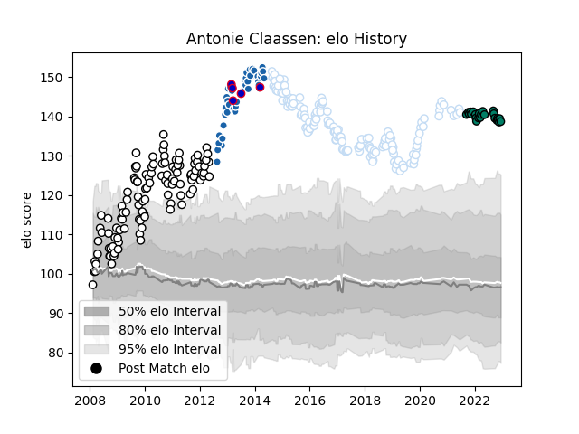

---  
layout: page  
title: Antonie Claassen  
date: 2023-01-15 11:48:26.069198  
categories: player  
---
# Antonie Claassen

## Positions: N8, FL

## Country: France

## Current elo: 125.0

## Current Percentile: 92.0

# Elo History

# Match History

| Team              |   Appearances |   Win Rate |
|:------------------|--------------:|-----------:|
| Racing 92         |           151 |   0.652318 |
| Brive             |           119 |   0.457983 |
| Castres Olympique |            50 |   0.6      |
| Suresnes          |            32 |   0.46875  |
| France            |             6 |   0.416667 |

| Opponent                   |   Matches |   Win Rate |
|:---------------------------|----------:|-----------:|
| Montpellier Herault        |        22 |   0.704545 |
| Stade Francais Paris       |        21 |   0.595238 |
| Castres Olympique          |        21 |   0.52381  |
| Toulon                     |        20 |   0.575    |
| Stade Toulousain           |        20 |   0.45     |
| Clermont Auvergne          |        17 |   0.617647 |
| Bordeaux Begles            |        15 |   0.566667 |
| Bayonne                    |        14 |   0.428571 |
| La Rochelle                |        14 |   0.428571 |
| Biarritz Olympique         |        12 |   0.375    |
| Agen                       |        11 |   0.590909 |
| Perpignan                  |        11 |   0.545455 |
| Grenoble                   |        10 |   0.7      |
| Racing 92                  |        10 |   0.25     |
| Bourgoin-Jallieu           |        10 |   0.6      |
| Brive                      |        10 |   0.8      |
| Lyon                       |         9 |   0.555556 |
| Northampton Saints         |         7 |   0.785714 |
| Pau                        |         6 |   0.583333 |
| Munster                    |         6 |   0.416667 |
| Dax                        |         5 |   0.8      |
| Oyonnax                    |         5 |   0.4      |
| Montauban                  |         5 |   0.6      |
| Glasgow Warriors           |         4 |   0.5      |
| Scarlets                   |         4 |   0.75     |
| Saracens                   |         4 |   0.5      |
| Leicester Tigers           |         4 |   1        |
| Albi                       |         4 |   0.75     |
| Mont-de-Marsan             |         4 |   1        |
| Ospreys                    |         4 |   0.625    |
| Nice                       |         3 |   0.333333 |
| Ulster                     |         3 |   0.333333 |
| Blagnac                    |         3 |   0.333333 |
| Valence Romans Drome Rugby |         3 |   0        |
| Leinster                   |         3 |   0        |
| Newcastle Falcons          |         2 |   1        |
| Sale Sharks                |         2 |   1        |
| Aubenas                    |         2 |   0.5      |
| Auch                       |         2 |   1        |
| Benetton Treviso           |         2 |   1        |
| Soyaux-Angouleme           |         2 |   0        |
| Scotland                   |         2 |   1        |
| New Zealand                |         2 |   0        |
| Cognac Saint Jean d'Angély |         2 |   1        |
| Rennes                     |         2 |   1        |
| Carqueiranne-Hyères        |         2 |   0.5      |
| London Irish               |         2 |   0        |
| Chambery                   |         2 |   0.5      |
| Dijon                      |         2 |   1        |
| Ireland                    |         1 |   0.5      |
| Massy                      |         1 |   0        |
| Tarbes                     |         1 |   1        |
| England                    |         1 |   0        |
| US Bressane                |         1 |   0        |
| Exeter Chiefs              |         1 |   0        |