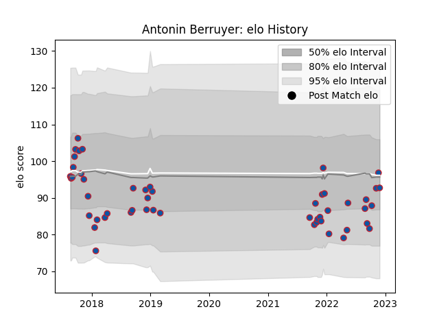

---  
layout: page  
title: Antonin Berruyer  
date: 2023-02-24 02:33:47.993195  
categories: player  
---
# Antonin Berruyer

## Positions: FL, N8

## Current elo: 93.0

## Current Percentile: 51.0

# Elo History

# Match History

| Team     |   Appearances |   Win Rate |
|:---------|--------------:|-----------:|
| Grenoble |            51 |   0.441176 |

| Opponent             |   Matches |   Win Rate |
|:---------------------|----------:|-----------:|
| Carcassonne          |         4 |   0.75     |
| Beziers              |         4 |   0.5      |
| Agen                 |         3 |   0.666667 |
| Narbonne             |         3 |   0.833333 |
| Aurillac             |         3 |   0.666667 |
| Mont-de-Marsan       |         3 |   0.666667 |
| Vannes               |         3 |   0.333333 |
| Montauban            |         2 |   0.25     |
| US Bressane          |         2 |   0.5      |
| Soyaux-Angouleme     |         2 |   1        |
| Perpignan            |         2 |   0        |
| Oyonnax              |         2 |   0        |
| Biarritz Olympique   |         2 |   0.5      |
| Colomiers            |         2 |   0        |
| Nevers               |         2 |   0.25     |
| Benetton Treviso     |         1 |   0        |
| Massy                |         1 |   1        |
| Bayonne              |         1 |   1        |
| Castres Olympique    |         1 |   0        |
| Harlequins           |         1 |   0        |
| Pau                  |         1 |   0        |
| Dax                  |         1 |   1        |
| Provence Rugby       |         1 |   0        |
| Stade Francais Paris |         1 |   0        |
| Stade Toulousain     |         1 |   0        |
| Toulon               |         1 |   0        |
| Clermont Auvergne    |         1 |   0        |