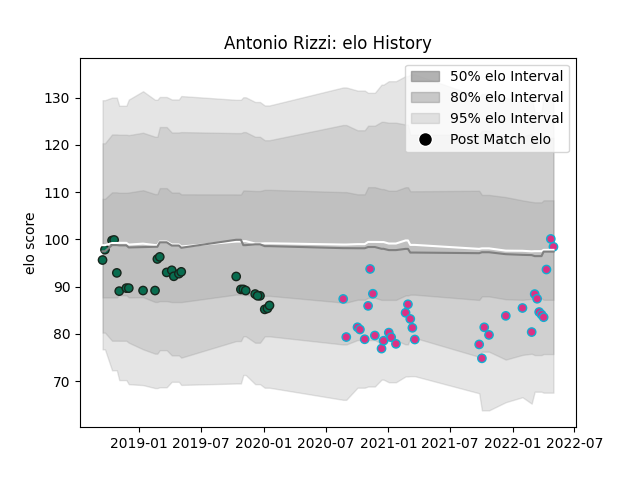

---  
layout: page  
title: Antonio Rizzi  
date: 2023-02-24 02:36:51.369089  
categories: player  
---
# Antonio Rizzi

## Positions: FH

## Current elo: 98.0

## Current Percentile: 58.0

# Elo History

# Match History

| Team             |   Appearances |   Win Rate |
|:-----------------|--------------:|-----------:|
| Zebre            |            34 |   0.220588 |
| Benetton Treviso |            27 |   0.425926 |

| Opponent           |   Matches |   Win Rate |
|:-------------------|----------:|-----------:|
| Leinster           |         6 |  0.0833333 |
| Scarlets           |         5 |  0.2       |
| Ospreys            |         5 |  0.2       |
| Edinburgh          |         5 |  0.4       |
| Benetton Treviso   |         4 |  0.75      |
| Ulster             |         4 |  0         |
| Dragons            |         4 |  0.75      |
| Glasgow Warriors   |         3 |  0         |
| Munster            |         3 |  0         |
| Southern Kings     |         2 |  1         |
| Lyon               |         2 |  0.5       |
| Agen               |         2 |  0.5       |
| Connacht           |         2 |  0         |
| Zebre              |         2 |  1         |
| Grenoble           |         1 |  1         |
| Bayonne            |         1 |  0.5       |
| Lions              |         1 |  0         |
| Cheetahs           |         1 |  0         |
| Newcastle Falcons  |         1 |  0         |
| Northampton Saints |         1 |  0         |
| Cardiff Blues      |         1 |  0         |
| Bulls              |         1 |  0         |
| Sharks             |         1 |  0         |
| Brive              |         1 |  1         |
| Stormers           |         1 |  0         |
| Biarritz Olympique |         1 |  0         |