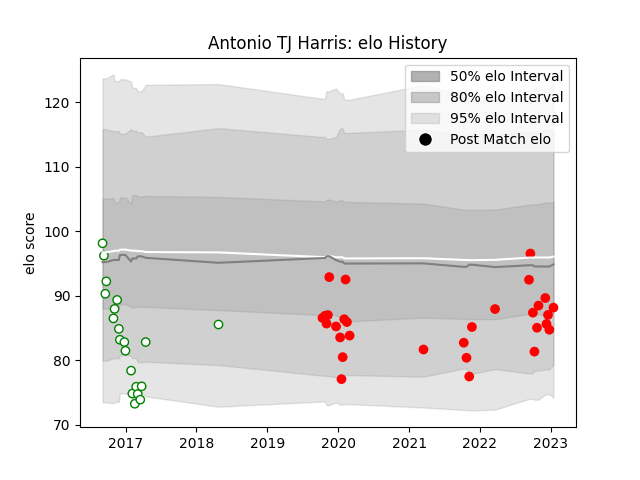

---  
layout: page  
title: Antonio TJ Harris  
date: 2022-12-14 11:36:32.953827  
categories: player  
---
# Antonio TJ Harris

## Positions: H

## Current elo: 89.0

## Current Percentile: 19.0

# Elo History

# Match History

| Team       |   Appearances |   Win Rate |
|:-----------|--------------:|-----------:|
| Jersey     |            20 |   0.6      |
| Nottingham |             9 |   0.388889 |

| Opponent            |   Matches |   Win Rate |
|:--------------------|----------:|-----------:|
| Cornish Pirates     |         3 |   0.333333 |
| London Scottish     |         3 |   0.666667 |
| Doncaster           |         3 |   0.333333 |
| Ampthill            |         2 |   1        |
| Hartpury College    |         2 |   1        |
| Richmond            |         2 |   1        |
| Yorkshire Carnegie  |         2 |   0.5      |
| Ealing Trailfinders |         2 |   0        |
| Coventry            |         2 |   1        |
| Bedford             |         1 |   0        |
| London Welsh        |         1 |   0        |
| Newcastle Falcons   |         1 |   0        |
| Nottingham          |         1 |   1        |
| Caldy               |         1 |   1        |
| Rotherham Titans    |         1 |   0.5      |
| Saracens            |         1 |   0        |
| Jersey              |         1 |   0        |