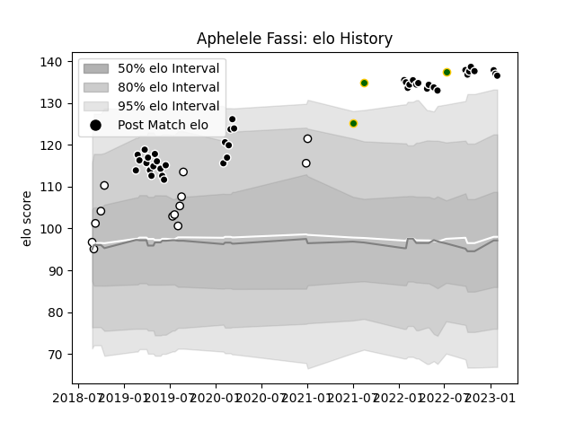

---  
layout: page  
title: Aphelele Fassi  
date: 2023-02-02 19:03:02.179283  
categories: player  
---
# Aphelele Fassi

## Positions: FB

## Country: South Africa

## Current elo: 137.0

## Current Percentile: 96.0

# Elo History

# Match History

| Team         |   Appearances |   Win Rate |
|:-------------|--------------:|-----------:|
| Sharks       |            41 |   0.634146 |
| Natal Sharks |            13 |   0.692308 |
| South Africa |             3 |   0.666667 |

| Opponent                 |   Matches |   Win Rate |
|:-------------------------|----------:|-----------:|
| Bulls                    |         5 |   0.4      |
| Stormers                 |         5 |   0.5      |
| Free State Cheetahs      |         3 |   0.666667 |
| Lions                    |         3 |   1        |
| Griquas                  |         3 |   0.666667 |
| Jaguares                 |         3 |   0.333333 |
| Zebre                    |         2 |   1        |
| Leinster                 |         2 |   0.5      |
| Melbourne Rebels         |         2 |   1        |
| Pumas                    |         2 |   0.5      |
| Hurricanes               |         2 |   0        |
| Queensland Reds          |         2 |   0.5      |
| Western Province         |         2 |   0.5      |
| Blue Bulls               |         2 |   1        |
| Sunwolves                |         1 |   1        |
| New South Wales Waratahs |         1 |   1        |
| Ulster                   |         1 |   0        |
| Wales                    |         1 |   0        |
| Scarlets                 |         1 |   1        |
| Argentina                |         1 |   1        |
| Highlanders              |         1 |   1        |
| Benetton Treviso         |         1 |   1        |
| Golden Lions             |         1 |   1        |
| Glasgow Warriors         |         1 |   1        |
| Georgia                  |         1 |   1        |
| Edinburgh                |         1 |   1        |
| Dragons                  |         1 |   1        |
| Crusaders                |         1 |   0.5      |
| Connacht                 |         1 |   1        |
| Chiefs                   |         1 |   0        |
| Bordeaux Begles          |         1 |   1        |
| Blues                    |         1 |   1        |
| Harlequins               |         1 |   0        |