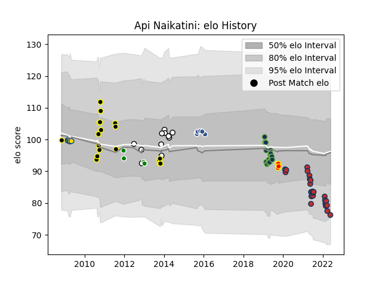

---  
layout: page  
title: Api Naikatini  
date: 2023-03-09 10:11:08.842108  
categories: player  
---
# Api Naikatini

## Positions: L

## Country: Fiji

## Current elo: 76.0

## Current Percentile: 12.0

# Elo History

# Match History

| Team              |   Appearances |   Win Rate |
|:------------------|--------------:|-----------:|
| Old Glory DC      |            24 |   0.3125   |
| Seattle Seawolves |            18 |   0.805556 |
| Wellington        |            18 |   0.444444 |
| Fiji              |             7 |   0.428571 |
| Agen              |             6 |   0.166667 |
| Hurricanes        |             5 |   0.8      |
| Brive             |             4 |   0.5      |
| Toyota Verblitz   |             4 |   0.5      |
| Waikato           |             4 |   0.25     |

| Opponent                        |   Matches |   Win Rate |
|:--------------------------------|----------:|-----------:|
| NOLA Gold                       |         5 |   0.3      |
| Toronto Arrows                  |         5 |   0.4      |
| Canterbury                      |         4 |   0        |
| San Diego Legion                |         4 |   0.5      |
| Rugby ATL                       |         4 |   0.25     |
| Houston SaberCats               |         4 |   0.75     |
| Utah Warriors                   |         3 |   0.5      |
| Taranaki                        |         3 |   1        |
| Rugby New York                  |         3 |   0.666667 |
| R.U. New York                   |         3 |   0.666667 |
| Auckland                        |         3 |   0.333333 |
| Counties Manukau                |         2 |   0.5      |
| Glendale Raptors                |         2 |   1        |
| Austin Gilgronis                |         2 |   0.5      |
| Hawke's Bay                     |         2 |   0.5      |
| Bay of Plenty                   |         2 |   0        |
| Seattle Seawolves               |         2 |   1        |
| Italy                           |         2 |   0.5      |
| New England Free Jacks          |         2 |   0        |
| Castres Olympique               |         1 |   0        |
| Stade Francais Paris            |         1 |   1        |
| Black Rams Tokyo                |         1 |   1        |
| Scotland                        |         1 |   0        |
| Sharks                          |         1 |   0        |
| Southland                       |         1 |   1        |
| Tasman                          |         1 |   0        |
| Stade Toulousain                |         1 |   0        |
| Bath Rugby                      |         1 |   0        |
| Romania                         |         1 |   1        |
| Tokyo Sungoliath                |         1 |   0        |
| Austin Herd                     |         1 |   1        |
| Toulon                          |         1 |   0        |
| Waikato                         |         1 |   1        |
| Blues                           |         1 |   1        |
| Otago                           |         1 |   0        |
| Brive                           |         1 |   0        |
| L. A. Giltinis                  |         1 |   0        |
| England                         |         1 |   0        |
| Grenoble                        |         1 |   0        |
| Highlanders                     |         1 |   1        |
| Calvisano                       |         1 |   1        |
| Ireland                         |         1 |   0        |
| Kobelco Kobe Steelers           |         1 |   0        |
| Lions                           |         1 |   1        |
| Portugal                        |         1 |   1        |
| London Irish                    |         1 |   0        |
| Austin Elite Rugby              |         1 |   1        |
| NTT Docomo Red Hurricanes Osaka |         1 |   1        |
| Newcastle Falcons               |         1 |   1        |
| North Harbour                   |         1 |   1        |
| Cheetahs                        |         1 |   1        |
| Wellington                      |         1 |   0        |