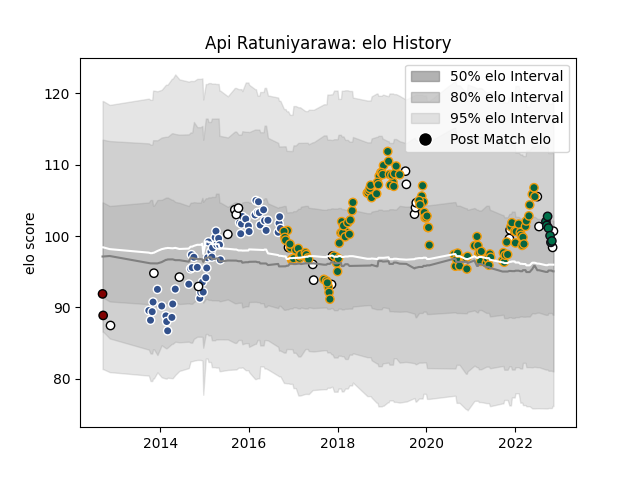

---  
layout: page  
title: Api Ratuniyarawa  
date: 2022-12-09 13:21:35.153948  
categories: player  
---
# Api Ratuniyarawa

## Positions: L

## Country: Fiji

## Current elo: 104.0

## Current Percentile: 76.0

# Elo History

# Match History

| Team               |   Appearances |   Win Rate |
|:-------------------|--------------:|-----------:|
| Northampton Saints |           123 |   0.447154 |
| Agen               |            56 |   0.473214 |
| Fiji               |            24 |   0.354167 |
| London Irish       |             9 |   0.333333 |
| North Harbour      |             2 |   0        |

| Opponent             |   Matches |   Win Rate |
|:---------------------|----------:|-----------:|
| Harlequins           |        12 |   0.583333 |
| Bath Rugby           |        12 |   0.333333 |
| Sale Sharks          |        12 |   0.416667 |
| Gloucester Rugby     |        12 |   0.5      |
| Leicester Tigers     |        11 |   0.363636 |
| Exeter Chiefs        |        10 |   0.3      |
| Wasps                |        10 |   0.4      |
| Newcastle Falcons    |        10 |   0.5      |
| Bristol Rugby        |         7 |   0.428571 |
| Worcester Warriors   |         7 |   1        |
| Saracens             |         7 |   0        |
| Clermont Auvergne    |         5 |   0.2      |
| Montpellier Herault  |         4 |   0.25     |
| London Irish         |         4 |   0.75     |
| Leinster             |         4 |   0        |
| Pau                  |         4 |   0.25     |
| New Zealand Maori    |         3 |   0.333333 |
| La Rochelle          |         3 |   0.666667 |
| Italy                |         3 |   0.666667 |
| Narbonne             |         3 |   0.666667 |
| Albi                 |         3 |   1        |
| Lyon                 |         3 |   0.666667 |
| England              |         3 |   0        |
| Aurillac             |         3 |   0.333333 |
| Dax                  |         3 |   0.333333 |
| Colomiers            |         3 |   0.666667 |
| Carcassonne          |         3 |   0.666667 |
| Beziers              |         3 |   0.333333 |
| Biarritz Olympique   |         3 |   0.666667 |
| Bordeaux Begles      |         2 |   0        |
| Wales                |         2 |   0        |
| Uruguay              |         2 |   0.5      |
| Toulon               |         2 |   0        |
| Tarbes               |         2 |   0.5      |
| Benetton Treviso     |         2 |   1        |
| Perpignan            |         2 |   0        |
| Oyonnax              |         2 |   0.5      |
| Georgia              |         2 |   0.75     |
| Ireland              |         2 |   0        |
| Castres Olympique    |         2 |   0        |
| Auch                 |         2 |   0.5      |
| Massy                |         2 |   1        |
| Brive                |         1 |   1        |
| Stade Francais Paris |         1 |   1        |
| Dragons              |         1 |   1        |
| Vannes               |         1 |   0.5      |
| Tonga                |         1 |   1        |
| Manawatu             |         1 |   0        |
| Stade Toulousain     |         1 |   0        |
| Scotland             |         1 |   0        |
| Northampton Saints   |         1 |   0        |
| Australia            |         1 |   0        |
| Samoa                |         1 |   0        |
| Portugal             |         1 |   1        |
| Mont-de-Marsan       |         1 |   1        |
| Montauban            |         1 |   1        |
| Canada               |         1 |   1        |
| Otago                |         1 |   0        |
| France               |         1 |   0        |
| Ospreys              |         1 |   0        |