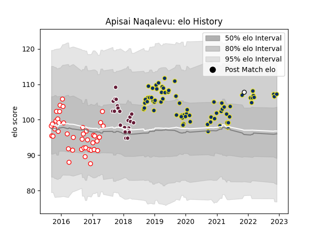

---  
layout: page  
title: Apisai Naqalevu  
date: 2022-12-09 13:23:12.129757  
categories: player  
---
# Apisai Naqalevu

## Positions: C

## Country: Fiji

## Current elo: 107.0

## Current Percentile: 81.0

# Elo History

# Match History

| Team              |   Appearances |   Win Rate |
|:------------------|--------------:|-----------:|
| Clermont Auvergne |            70 |   0.664286 |
| Dax               |            42 |   0.452381 |
| Bordeaux Begles   |            21 |   0.404762 |
| Fiji              |             1 |   0        |

| Opponent             |   Matches |   Win Rate |
|:---------------------|----------:|-----------:|
| Lyon                 |         9 |  0.555556  |
| Pau                  |         8 |  0.75      |
| Agen                 |         7 |  0.857143  |
| La Rochelle          |         7 |  0.571429  |
| Perpignan            |         7 |  0.857143  |
| Castres Olympique    |         6 |  0.333333  |
| Racing 92            |         6 |  0.25      |
| Stade Toulousain     |         6 |  0.0833333 |
| Montpellier Herault  |         5 |  0.4       |
| Dragons              |         4 |  0.75      |
| Bourgoin-Jallieu     |         4 |  0.5       |
| Brive                |         4 |  0.375     |
| Carcassonne          |         4 |  0.25      |
| Toulon               |         4 |  0.5       |
| Stade Francais Paris |         4 |  1         |
| Bayonne              |         4 |  0.5       |
| Aurillac             |         3 |  0.333333  |
| Oyonnax              |         3 |  0.666667  |
| Biarritz Olympique   |         3 |  0.333333  |
| Mont-de-Marsan       |         3 |  0.333333  |
| Bordeaux Begles      |         3 |  0.666667  |
| Beziers              |         3 |  0.333333  |
| Tarbes               |         2 |  0         |
| Timisoara Saracens   |         2 |  1         |
| Soyaux-Angouleme     |         2 |  0.5       |
| Ulster               |         2 |  0.5       |
| Vannes               |         2 |  1         |
| Montauban            |         2 |  0.5       |
| Northampton Saints   |         2 |  1         |
| Narbonne             |         2 |  0.5       |
| Harlequins           |         2 |  1         |
| Colomiers            |         2 |  0.5       |
| Bath Rugby           |         2 |  1         |
| Provence Rugby       |         1 |  1         |
| Newcastle Falcons    |         1 |  0         |
| Grenoble             |         1 |  0.5       |
| Clermont Auvergne    |         1 |  1         |
| Wales                |         1 |  0         |