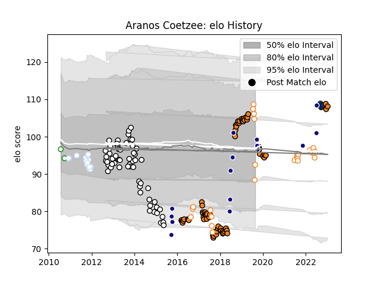

---  
layout: page  
title: Aranos Coetzee  
date: 2023-01-17 11:34:31.308652  
categories: player  
---
# Aranos Coetzee

## Positions: P

## Country: Namibia

## Current elo: 92.0

## Current Percentile: 74.0

# Elo History

# Match History

| Team                |   Appearances |   Win Rate |
|:--------------------|--------------:|-----------:|
| Cheetahs            |            76 |   0.401316 |
| Brive               |            60 |   0.525    |
| Free State Cheetahs |            25 |   0.62     |
| Namibia             |            15 |   0.533333 |
| Racing 92           |            14 |   0.571429 |
| Bath Rugby          |             5 |   0.2      |
| Leopards            |             2 |   0        |

| Opponent             |   Matches |   Win Rate |
|:---------------------|----------:|-----------:|
| Southern Kings       |         9 |   1        |
| Oyonnax              |         7 |   0.285714 |
| Scarlets             |         6 |   0.166667 |
| Zebre                |         6 |   0.666667 |
| Cardiff Blues        |         6 |   0.333333 |
| Western Province     |         6 |   0.666667 |
| Griquas              |         6 |   0.5      |
| Connacht             |         5 |   0.2      |
| Pumas                |         5 |   0.6      |
| Munster              |         4 |   0        |
| Blue Bulls           |         4 |   0.5      |
| Ospreys              |         4 |   0.25     |
| Bulls                |         4 |   0.25     |
| Sunwolves            |         4 |   1        |
| Castres Olympique    |         4 |   0.5      |
| Glasgow Warriors     |         4 |   0        |
| Racing 92            |         3 |   0.5      |
| Lyon                 |         3 |   0.666667 |
| Kenya                |         3 |   1        |
| Natal Sharks         |         3 |   0.666667 |
| Stade Toulousain     |         3 |   0.333333 |
| Golden Lions         |         3 |   0.5      |
| Pau                  |         3 |   0.666667 |
| Edinburgh            |         3 |   0.333333 |
| Ulster               |         3 |   0.166667 |
| Bayonne              |         3 |   0        |
| Biarritz Olympique   |         3 |   0.333333 |
| Colomiers            |         2 |   1        |
| Auch                 |         2 |   1        |
| Aurillac             |         2 |   0.5      |
| Newcastle Falcons    |         2 |   1        |
| New Zealand          |         2 |   0        |
| Benetton Treviso     |         2 |   0.5      |
| Beziers              |         2 |   1        |
| Bordeaux Begles      |         2 |   0.5      |
| London Irish         |         2 |   0.5      |
| Lions                |         2 |   0        |
| Sharks               |         2 |   0        |
| Clermont Auvergne    |         2 |   0        |
| Zimbabwe             |         2 |   1        |
| Provence Rugby       |         2 |   1        |
| Stormers             |         2 |   0        |
| Bucuresti            |         2 |   1        |
| Calvisano            |         2 |   0.75     |
| Dax                  |         2 |   0.5      |
| Dragons              |         2 |   1        |
| Stade Francais Paris |         2 |   0.5      |
| Gloucester Rugby     |         2 |   0        |
| Toulon               |         2 |   0        |
| Tarbes               |         2 |   1        |
| Wasps                |         1 |   0        |
| Tonga                |         1 |   0        |
| Queensland Reds      |         1 |   0        |
| Tunisia              |         1 |   1        |
| Sale Sharks          |         1 |   0        |
| Saracens             |         1 |   1        |
| Western Force        |         1 |   1        |
| Uganda               |         1 |   1        |
| South Africa         |         1 |   0        |
| Agen                 |         1 |   1        |
| Perpignan            |         1 |   1        |
| Northampton Saints   |         1 |   1        |
| Argentina            |         1 |   0        |
| Bath Rugby           |         1 |   0        |
| Blues                |         1 |   0        |
| Bristol Rugby        |         1 |   0        |
| Brive                |         1 |   1        |
| Brumbies             |         1 |   0        |
| Carcassonne          |         1 |   0        |
| Chiefs               |         1 |   0        |
| Crusaders            |         1 |   0        |
| Georgia              |         1 |   0        |
| Grenoble             |         1 |   0.5      |
| Highlanders          |         1 |   0        |
| Hurricanes           |         1 |   0        |
| Italy                |         1 |   0        |
| Jaguares             |         1 |   0        |
| La Rochelle          |         1 |   1        |
| Albi                 |         1 |   1        |
| Massy                |         1 |   1        |
| Montpellier Herault  |         1 |   1        |
| Morocco              |         1 |   1        |
| Narbonne             |         1 |   0        |
| Leinster             |         1 |   1        |