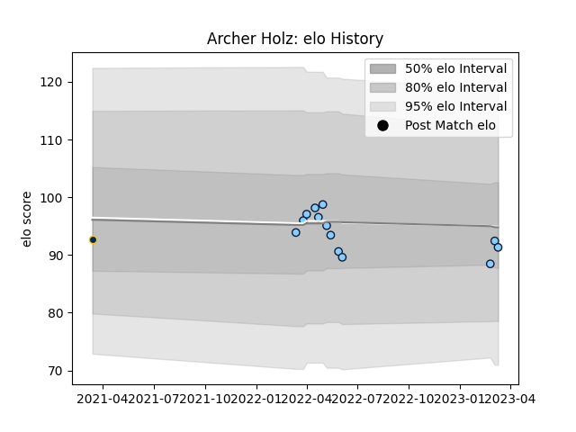

---  
layout: page  
title: Archer Holz  
date: 2023-03-17 17:41:15.235994  
categories: player  
---
# Archer Holz

## Positions: P

## Current elo: 91.0

## Current Percentile: 40.0

# Elo History

# Match History

| Team                     |   Appearances |   Win Rate |
|:-------------------------|--------------:|-----------:|
| New South Wales Waratahs |            13 |   0.461538 |
| Brumbies                 |             1 |   0        |

| Opponent         |   Matches |   Win Rate |
|:-----------------|----------:|-----------:|
| Chiefs           |         2 |          0 |
| Fijian Drua      |         2 |          1 |
| Queensland Reds  |         2 |          0 |
| Western Force    |         2 |          1 |
| Blues            |         1 |          0 |
| Brumbies         |         1 |          0 |
| Crusaders        |         1 |          1 |
| Hurricanes       |         1 |          0 |
| Melbourne Rebels |         1 |          0 |
| Moana Pasifika   |         1 |          1 |