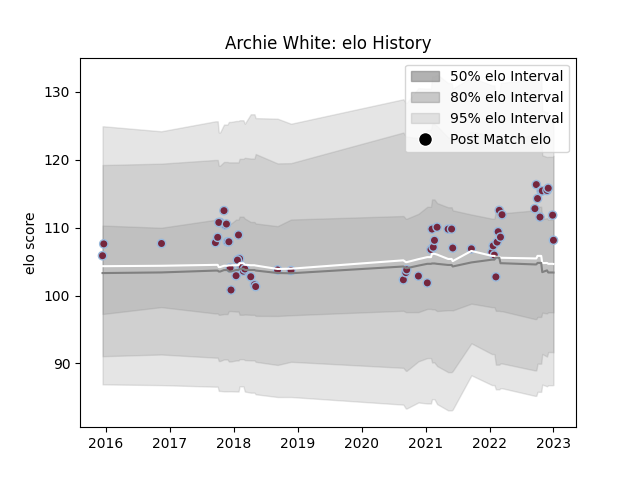

---  
layout: page  
title: Archie White  
date: 2022-12-09 13:15:54.409844  
categories: player  
---
# Archie White

## Positions: FL, N8

## Current elo: 100.0

## Current Percentile: 59.0

# Elo History

# Match History

| Team       |   Appearances |   Win Rate |
|:-----------|--------------:|-----------:|
| Harlequins |            56 |   0.544643 |

| Opponent           |   Matches |   Win Rate |
|:-------------------|----------:|-----------:|
| Bath Rugby         |         6 |   0.666667 |
| Wasps              |         6 |   0.833333 |
| Northampton Saints |         5 |   0.4      |
| Sale Sharks        |         5 |   0.6      |
| Worcester Warriors |         5 |   0.4      |
| London Irish       |         4 |   0.625    |
| Exeter Chiefs      |         4 |   0        |
| Saracens           |         4 |   0.5      |
| Leicester Tigers   |         3 |   0.333333 |
| Newcastle Falcons  |         3 |   0.666667 |
| La Rochelle        |         2 |   0        |
| Gloucester Rugby   |         2 |   1        |
| Ulster             |         2 |   0        |
| Calvisano          |         2 |   1        |
| Bristol Rugby      |         1 |   1        |
| Ospreys            |         1 |   1        |
| Scarlets           |         1 |   1        |