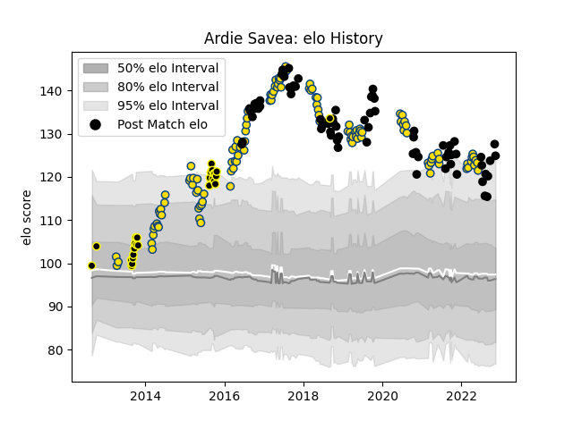

---  
layout: page  
title: Ardie Savea  
date: 2022-11-16 11:42:29.142259  
categories: player  
---
# Ardie Savea

## Positions: FL, N8

## Country: New Zealand

## Current elo: 125.0

## Current Percentile: 96.0

# Elo History

# Match History

| Team        |   Appearances |   Win Rate |
|:------------|--------------:|-----------:|
| Hurricanes  |           119 |   0.659664 |
| New Zealand |            72 |   0.763889 |
| Wellington  |            26 |   0.75     |

| Opponent                 |   Matches |   Win Rate |
|:-------------------------|----------:|-----------:|
| Australia                |        20 |   0.825    |
| Crusaders                |        17 |   0.411765 |
| Blues                    |        16 |   0.6875   |
| Highlanders              |        16 |   0.6875   |
| Chiefs                   |        14 |   0.535714 |
| Argentina                |        12 |   0.833333 |
| South Africa             |        10 |   0.7      |
| Brumbies                 |         9 |   0.444444 |
| Ireland                  |         8 |   0.375    |
| Queensland Reds          |         6 |   1        |
| New South Wales Waratahs |         6 |   0.666667 |
| France                   |         6 |   0.833333 |
| Lions                    |         6 |   0.833333 |
| Western Force            |         5 |   0.8      |
| Wales                    |         4 |   1        |
| Stormers                 |         4 |   0.5      |
| Sharks                   |         4 |   0.75     |
| Bulls                    |         4 |   0.75     |
| Melbourne Rebels         |         4 |   1        |
| Manawatu                 |         3 |   0.666667 |
| British and Irish Lions  |         3 |   0.5      |
| Otago                    |         3 |   0.666667 |
| Hawke's Bay              |         3 |   0.166667 |
| Jaguares                 |         3 |   0.666667 |
| Cheetahs                 |         2 |   1        |
| Waikato                  |         2 |   1        |
| North Harbour            |         2 |   1        |
| Northland                |         2 |   1        |
| England                  |         2 |   0.5      |
| Canterbury               |         2 |   0.5      |
| Taranaki                 |         2 |   1        |
| Bay of Plenty            |         2 |   1        |
| Sunwolves                |         2 |   1        |
| Southland                |         2 |   1        |
| Fiji                     |         1 |   1        |
| Tonga                    |         1 |   1        |
| Tasman                   |         1 |   0        |
| Auckland                 |         1 |   1        |
| Southern Kings           |         1 |   1        |
| Scotland                 |         1 |   1        |
| Samoa                    |         1 |   1        |
| Canada                   |         1 |   1        |
| Namibia                  |         1 |   1        |
| Italy                    |         1 |   1        |
| Counties Manukau         |         1 |   1        |