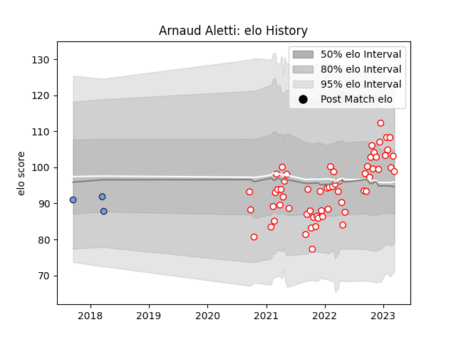

---  
layout: page  
title: Arnaud Aletti  
date: 2023-01-15 11:47:00.661923  
categories: player  
---
# Arnaud Aletti

## Positions: FL

## Current elo: 99.0

## Current Percentile: 80.0

# Elo History

# Match History

| Team    |   Appearances |   Win Rate |
|:--------|--------------:|-----------:|
| Dax     |            55 |   0.581818 |
| Bayonne |             3 |   0.333333 |

| Opponent                   |   Matches |   Win Rate |
|:---------------------------|----------:|-----------:|
| Chambery                   |         5 |   0.8      |
| Nice                       |         5 |   0.8      |
| Albi                       |         4 |   0.25     |
| Tarbes                     |         4 |   0.5      |
| Blagnac                    |         4 |   0.75     |
| Bourgoin-Jallieu           |         4 |   0.5      |
| Cognac Saint Jean d'Angély |         4 |   0.25     |
| Dijon                      |         4 |   0.75     |
| Suresnes                   |         4 |   0.5      |
| Massy                      |         3 |   0        |
| Valence Romans Drome Rugby |         3 |   0.666667 |
| Aubenas                    |         3 |   0.666667 |
| US Bressane                |         3 |   0.666667 |
| Soyaux-Angouleme           |         3 |   0.333333 |
| Narbonne                   |         2 |   1        |
| Rennes                     |         1 |   1        |
| Mont-de-Marsan             |         1 |   1        |
| Vannes                     |         1 |   0        |