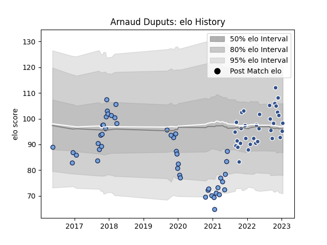

---  
layout: page  
title: Arnaud Duputs  
date: 2022-11-22 11:29:27.522558  
categories: player  
---
# Arnaud Duputs

## Positions: FL

## Current elo: 112.0

## Current Percentile: 92.0

# Elo History

# Match History

| Team    |   Appearances |   Win Rate |
|:--------|--------------:|-----------:|
| Bayonne |            36 |   0.319444 |
| Agen    |            26 |   0.461538 |

| Opponent             |   Matches |   Win Rate |
|:---------------------|----------:|-----------:|
| Toulon               |         4 |   0.5      |
| Provence Rugby       |         3 |   0.666667 |
| Nevers               |         3 |   0.666667 |
| Narbonne             |         3 |   0.666667 |
| Aurillac             |         3 |   1        |
| Mont-de-Marsan       |         3 |   0.666667 |
| Agen                 |         2 |   0.5      |
| Lyon                 |         2 |   0        |
| Stade Francais Paris |         2 |   0        |
| Soyaux-Angouleme     |         2 |   0        |
| Scarlets             |         2 |   0        |
| Rouen                |         2 |   1        |
| Pau                  |         2 |   0        |
| Montpellier Herault  |         2 |   0.5      |
| Montauban            |         2 |   0.5      |
| Vannes               |         2 |   1        |
| Bordeaux Begles      |         2 |   0        |
| Benetton Treviso     |         2 |   0        |
| Beziers              |         2 |   0        |
| Carcassonne          |         2 |   0        |
| Grenoble             |         2 |   0        |
| US Bressane          |         1 |   0        |
| Bayonne              |         1 |   0        |
| Stade Toulousain     |         1 |   1        |
| Biarritz Olympique   |         1 |   0        |
| La Rochelle          |         1 |   0        |
| Racing 92            |         1 |   1        |
| Perpignan            |         1 |   0        |
| Oyonnax              |         1 |   0        |
| Castres Olympique    |         1 |   0        |
| Colomiers            |         1 |   0        |
| Dax                  |         1 |   1        |
| Gloucester Rugby     |         1 |   0        |
| Brive                |         1 |   0.5      |