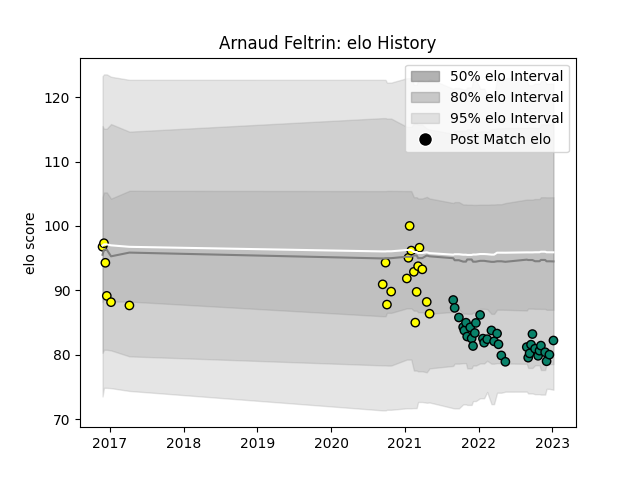

---  
layout: page  
title: Arnaud Feltrin  
date: 2022-12-18 16:15:10.678752  
categories: player  
---
# Arnaud Feltrin

## Positions: H

## Current elo: 92.0

## Current Percentile: 40.0

# Elo History

# Match History

| Team      |   Appearances |   Win Rate |
|:----------|--------------:|-----------:|
| Montauban |            17 |   0.411765 |
| Albi      |            16 |   0.625    |

| Opponent                   |   Matches |   Win Rate |
|:---------------------------|----------:|-----------:|
| US Bressane                |         4 |   0.625    |
| Bourgoin-Jallieu           |         3 |   0.666667 |
| Suresnes                   |         2 |   0.5      |
| Carcassonne                |         2 |   0        |
| Cognac Saint Jean d'Angély |         2 |   0.5      |
| Dax                        |         2 |   1        |
| Grenoble                   |         2 |   0        |
| Nevers                     |         2 |   0.5      |
| Agen                       |         1 |   1        |
| Nice                       |         1 |   1        |
| Soyaux-Angouleme           |         1 |   1        |
| Rouen                      |         1 |   0        |
| Provence Rugby             |         1 |   0        |
| Perpignan                  |         1 |   0        |
| Mont-de-Marsan             |         1 |   1        |
| Narbonne                   |         1 |   1        |
| Aubenas                    |         1 |   1        |
| Massy                      |         1 |   1        |
| Blagnac                    |         1 |   0        |
| Biarritz Olympique         |         1 |   0        |
| Beziers                    |         1 |   0        |
| Vannes                     |         1 |   0.5      |