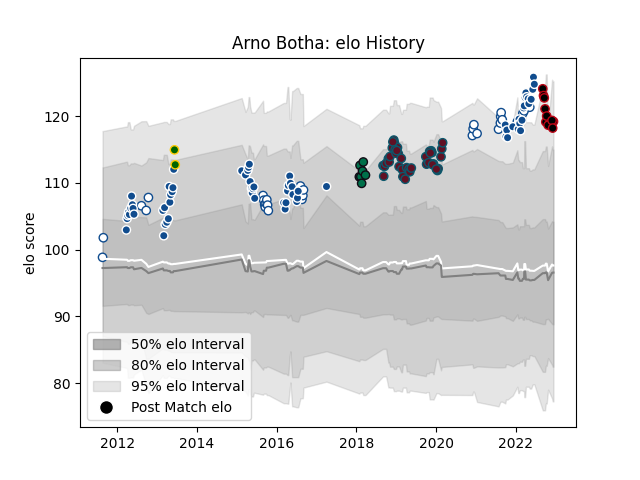

---  
layout: page  
title: Arno Botha  
date: 2023-01-06 00:17:22.387856  
categories: player  
---
# Arno Botha

## Positions: FL, N8

## Country: South Africa

## Current elo: 124.0

## Current Percentile: 92.0

# Elo History

# Match History

| Team         |   Appearances |   Win Rate |
|:-------------|--------------:|-----------:|
| Bulls        |            67 |   0.619403 |
| Blue Bulls   |            42 |   0.75     |
| Munster      |            42 |   0.77381  |
| Lyon         |            13 |   0.384615 |
| London Irish |             7 |   0.428571 |
| South Africa |             2 |   1        |

| Opponent                 |   Matches |   Win Rate |
|:-------------------------|----------:|-----------:|
| Stormers                 |         9 |   0.222222 |
| Griquas                  |         7 |   0.857143 |
| Golden Lions             |         7 |   0.857143 |
| Natal Sharks             |         7 |   0.428571 |
| Sharks                   |         6 |   0.583333 |
| Ospreys                  |         6 |   1        |
| Pumas                    |         6 |   0.833333 |
| Cheetahs                 |         6 |   0.833333 |
| Free State Cheetahs      |         6 |   0.75     |
| Western Province         |         5 |   0.6      |
| Lions                    |         5 |   0.8      |
| Ulster                   |         5 |   0.6      |
| Southern Kings           |         5 |   1        |
| Zebre                    |         4 |   1        |
| Leinster                 |         4 |   0.5      |
| Edinburgh                |         4 |   0.5      |
| Cardiff Blues            |         4 |   1        |
| Brumbies                 |         4 |   0.25     |
| Dragons                  |         3 |   1        |
| Scarlets                 |         3 |   0.666667 |
| Connacht                 |         3 |   0.666667 |
| Glasgow Warriors         |         3 |   0.666667 |
| Gloucester Rugby         |         3 |   0.666667 |
| Chiefs                   |         3 |   0        |
| Saracens                 |         3 |   0.333333 |
| Racing 92                |         3 |   0.166667 |
| Queensland Reds          |         3 |   1        |
| Western Force            |         3 |   1        |
| Melbourne Rebels         |         3 |   0.666667 |
| Sunwolves                |         2 |   1        |
| Wasps                    |         2 |   0.5      |
| New South Wales Waratahs |         2 |   1        |
| Leopards                 |         2 |   1        |
| Eastern Province Kings   |         2 |   1        |
| Blues                    |         2 |   0.5      |
| Brive                    |         2 |   0.5      |
| Castres Olympique        |         2 |   0.5      |
| Highlanders              |         2 |   0.5      |
| Benetton Treviso         |         2 |   1        |
| Crusaders                |         2 |   0.5      |
| Stade Francais Paris     |         1 |   1        |
| Worcester Warriors       |         1 |   1        |
| Bordeaux Begles          |         1 |   1        |
| Bulls                    |         1 |   0        |
| Toulon                   |         1 |   0        |
| Clermont Auvergne        |         1 |   0        |
| Stade Toulousain         |         1 |   1        |
| Munster                  |         1 |   1        |
| Scotland                 |         1 |   1        |
| Exeter Chiefs            |         1 |   1        |
| Sale Sharks              |         1 |   0        |
| Hurricanes               |         1 |   1        |
| Italy                    |         1 |   1        |
| Jaguares                 |         1 |   0        |
| Pau                      |         1 |   1        |
| La Rochelle              |         1 |   0        |
| Northampton Saints       |         1 |   0        |
| Bayonne                  |         1 |   0        |