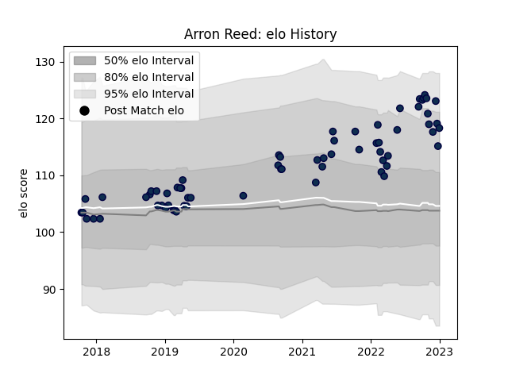

---  
layout: page  
title: Arron Reed  
date: 2023-03-17 17:40:41.386074  
categories: player  
---
# Arron Reed

## Positions: W

## Current elo: 110.0

## Current Percentile: 86.0

# Elo History

# Match History

| Team        |   Appearances |   Win Rate |
|:------------|--------------:|-----------:|
| Sale Sharks |            74 |   0.608108 |

| Opponent           |   Matches |   Win Rate |
|:-------------------|----------:|-----------:|
| Saracens           |         7 |   0.571429 |
| Bristol Rugby      |         6 |   0.75     |
| Exeter Chiefs      |         6 |   0.166667 |
| Northampton Saints |         6 |   0.5      |
| Leicester Tigers   |         6 |   1        |
| Worcester Warriors |         5 |   0.6      |
| Gloucester Rugby   |         5 |   0.8      |
| Harlequins         |         5 |   0.8      |
| London Irish       |         4 |   0.625    |
| Wasps              |         4 |   0.75     |
| Bath Rugby         |         4 |   0.625    |
| Connacht           |         3 |   0.666667 |
| Newcastle Falcons  |         2 |   0        |
| Perpignan          |         2 |   1        |
| Stade Toulousain   |         2 |   0.25     |
| Bordeaux Begles    |         1 |   0        |
| La Rochelle        |         1 |   0        |
| Ospreys            |         1 |   1        |
| Scarlets           |         1 |   1        |
| Ulster             |         1 |   1        |
| Cardiff Blues      |         1 |   0        |
| Lyon               |         1 |   0        |