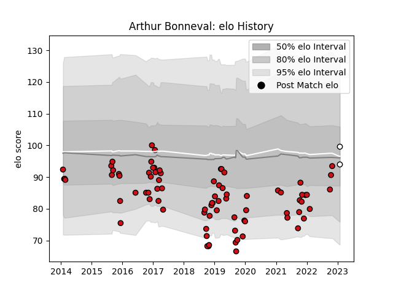

---  
layout: page  
title: Arthur Bonneval  
date: 2023-02-02 19:01:53.145866  
categories: player  
---
# Arthur Bonneval

## Positions: W

## Current elo: 94.0

## Current Percentile: 62.0

# Elo History

# Match History

| Team             |   Appearances |   Win Rate |
|:-----------------|--------------:|-----------:|
| Stade Toulousain |            80 |     0.6125 |
| Brive            |             2 |     0.5    |

| Opponent             |   Matches |   Win Rate |
|:---------------------|----------:|-----------:|
| Castres Olympique    |         6 |   0.5      |
| Racing 92            |         6 |   0.333333 |
| La Rochelle          |         6 |   0.5      |
| Montpellier Herault  |         6 |   0.5      |
| Agen                 |         5 |   1        |
| Brive                |         5 |   0.8      |
| Bayonne              |         5 |   0.2      |
| Pau                  |         5 |   0.6      |
| Clermont Auvergne    |         4 |   0.375    |
| Perpignan            |         4 |   0.75     |
| Lyon                 |         4 |   0.5      |
| Bordeaux Begles      |         3 |   0.666667 |
| Toulon               |         3 |   0.166667 |
| Grenoble             |         3 |   1        |
| Oyonnax              |         2 |   1        |
| Wasps                |         2 |   0.5      |
| Zebre                |         2 |   1        |
| Connacht             |         2 |   1        |
| Cardiff Blues        |         2 |   1        |
| Biarritz Olympique   |         2 |   1        |
| Munster              |         1 |   0        |
| Gloucester Rugby     |         1 |   1        |
| Stade Francais Paris |         1 |   1        |
| Ulster               |         1 |   0        |
| Leinster             |         1 |   1        |