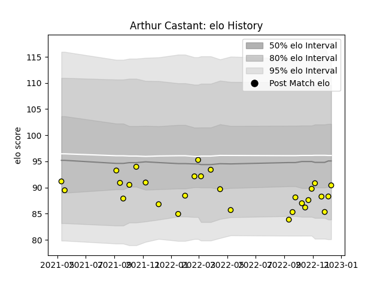

---  
layout: page  
title: Arthur Castant  
date: 2023-01-17 11:39:18.793160  
categories: player  
---
# Arthur Castant

## Positions: H

## Current elo: 106.0

## Current Percentile: 84.0

# Elo History

# Match History

| Team   |   Appearances |   Win Rate |
|:-------|--------------:|-----------:|
| Albi   |            44 |   0.715909 |

| Opponent                   |   Matches |   Win Rate |
|:---------------------------|----------:|-----------:|
| Chambery                   |         4 |   1        |
| Cognac Saint Jean d'Angély |         4 |   1        |
| Suresnes                   |         4 |   0.75     |
| Valence Romans Drome Rugby |         3 |   0.666667 |
| Bourgoin-Jallieu           |         3 |   1        |
| Tarbes                     |         3 |   0        |
| Dax                        |         3 |   0.666667 |
| Dijon                      |         3 |   1        |
| Nice                       |         3 |   0.166667 |
| Rennes                     |         2 |   1        |
| Soyaux-Angouleme           |         2 |   0        |
| Aubenas                    |         2 |   1        |
| Narbonne                   |         2 |   1        |
| Blagnac                    |         2 |   1        |
| Massy                      |         2 |   0.5      |
| Carqueiranne-Hyères        |         1 |   0        |
| US Bressane                |         1 |   1        |