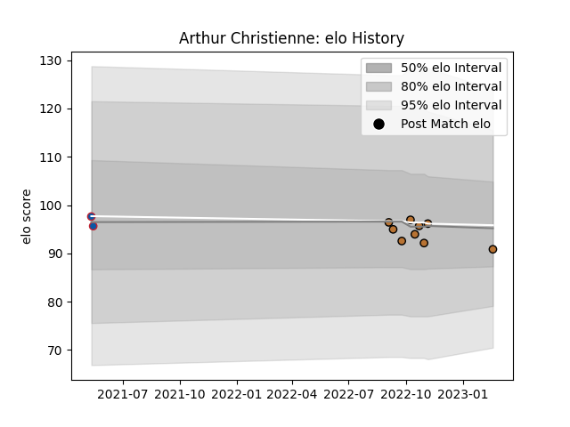

---  
layout: page  
title: Arthur Christienne  
date: 2023-02-24 02:35:46.398964  
categories: player  
---
# Arthur Christienne

## Positions: FL

## Current elo: 91.0

## Current Percentile: 52.0

# Elo History

# Match History

| Team     |   Appearances |   Win Rate |
|:---------|--------------:|-----------:|
| Narbonne |             9 |   0.333333 |
| Grenoble |             2 |   0.5      |

| Opponent                   |   Matches |   Win Rate |
|:---------------------------|----------:|-----------:|
| Tarbes                     |         2 |          0 |
| Albi                       |         1 |          0 |
| Bourgoin-Jallieu           |         1 |          0 |
| Chambery                   |         1 |          0 |
| Cognac Saint Jean d'Angély |         1 |          1 |
| Montauban                  |         1 |          0 |
| Nice                       |         1 |          1 |
| US Bressane                |         1 |          1 |
| Valence Romans Drome Rugby |         1 |          0 |
| Vannes                     |         1 |          1 |