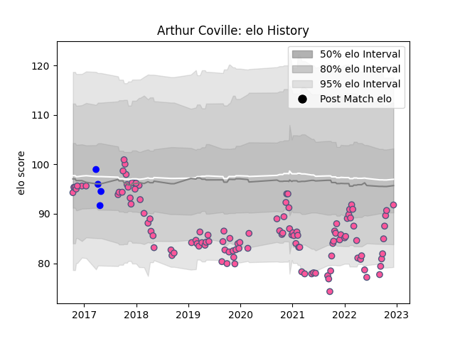

---  
layout: page  
title: Arthur Coville  
date: 2023-01-13 11:31:21.388381  
categories: player  
---
# Arthur Coville

## Positions: SH

## Current elo: 87.0

## Current Percentile: 30.0

# Elo History

# Match History

| Team                 |   Appearances |   Win Rate |
|:---------------------|--------------:|-----------:|
| Stade Francais Paris |           123 |   0.443089 |
| Vannes               |             7 |   0.714286 |

| Opponent            |   Matches |   Win Rate |
|:--------------------|----------:|-----------:|
| Clermont Auvergne   |        10 |   0.3      |
| Bordeaux Begles     |        10 |   0.3      |
| Lyon                |         9 |   0.333333 |
| Castres Olympique   |         9 |   0.555556 |
| Pau                 |         9 |   0.666667 |
| Toulon              |         8 |   0.375    |
| Brive               |         8 |   0.375    |
| La Rochelle         |         8 |   0.5      |
| Racing 92           |         7 |   0.285714 |
| Montpellier Herault |         7 |   0.357143 |
| Stade Toulousain    |         6 |   0.5      |
| Agen                |         6 |   0.333333 |
| Bayonne             |         5 |   0.6      |
| Perpignan           |         3 |   1        |
| Timisoara Saracens  |         2 |   1        |
| Edinburgh           |         2 |   1        |
| Benetton Treviso    |         2 |   0.5      |
| London Irish        |         2 |   0.5      |
| Bristol Rugby       |         2 |   0        |
| Biarritz Olympique  |         2 |   0.5      |
| Worcester Warriors  |         1 |   0        |
| Soyaux-Angouleme    |         1 |   1        |
| Oyonnax             |         1 |   1        |
| Krasny Yar          |         1 |   0        |
| Narbonne            |         1 |   1        |
| Lions               |         1 |   0        |
| Aurillac            |         1 |   1        |
| Harlequins          |         1 |   0        |
| Grenoble            |         1 |   0        |
| Colomiers           |         1 |   1        |
| Bourgoin-Jallieu    |         1 |   1        |
| Beziers             |         1 |   0        |
| Zebre               |         1 |   1        |