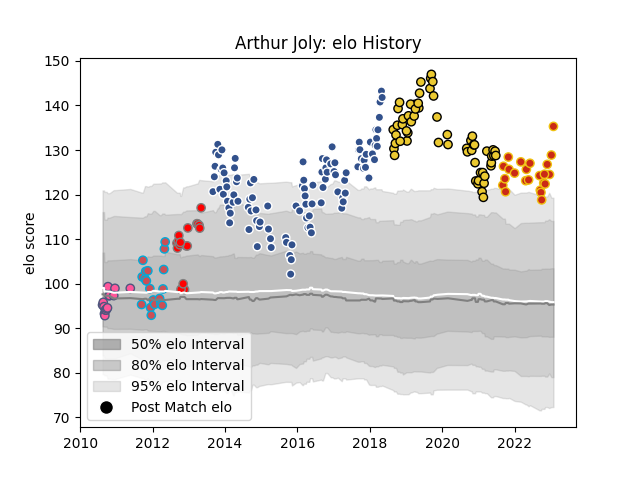

---  
layout: page  
title: Arthur Joly  
date: 2023-02-02 18:58:46.855186  
categories: player  
---
# Arthur Joly

## Positions: P

## Current elo: 135.0

## Current Percentile: 98.0

# Elo History

# Match History

| Team                 |   Appearances |   Win Rate |
|:---------------------|--------------:|-----------:|
| Agen                 |           104 |   0.509615 |
| La Rochelle          |            59 |   0.59322  |
| Perpignan            |            23 |   0.478261 |
| Bourgoin-Jallieu     |            19 |   0.421053 |
| London Welsh         |            17 |   0.294118 |
| Stade Francais Paris |            15 |   0.6      |

| Opponent             |   Matches |   Win Rate |
|:---------------------|----------:|-----------:|
| Racing 92            |        13 |   0.538462 |
| Toulon               |        12 |   0.75     |
| Pau                  |        12 |   0.333333 |
| Stade Francais Paris |        12 |   0.583333 |
| La Rochelle          |        11 |   0.454545 |
| Stade Toulousain     |        10 |   0.1      |
| Brive                |        10 |   0.4      |
| Lyon                 |         9 |   0.333333 |
| Castres Olympique    |         9 |   0.444444 |
| Montpellier Herault  |         8 |   0.5      |
| Bordeaux Begles      |         8 |   0.5      |
| Albi                 |         8 |   0.625    |
| Clermont Auvergne    |         7 |   0.285714 |
| Oyonnax              |         7 |   0.285714 |
| Beziers              |         7 |   0.285714 |
| Grenoble             |         6 |   0.5      |
| Narbonne             |         6 |   0.5      |
| Bourgoin-Jallieu     |         5 |   0.6      |
| Biarritz Olympique   |         5 |   0.4      |
| Aurillac             |         5 |   0.4      |
| Mont-de-Marsan       |         4 |   1        |
| Agen                 |         4 |   1        |
| Colomiers            |         4 |   0.875    |
| Carcassonne          |         4 |   0.75     |
| Gloucester Rugby     |         3 |   0        |
| Dax                  |         3 |   0.333333 |
| Bayonne              |         3 |   0.333333 |
| Montauban            |         3 |   1        |
| Perpignan            |         3 |   0.333333 |
| Soyaux-Angouleme     |         2 |   1        |
| Sale Sharks          |         2 |   1        |
| US Bressane          |         2 |   1        |
| Vannes               |         2 |   0.75     |
| Worcester Warriors   |         2 |   0.5      |
| Tarbes               |         2 |   1        |
| London Irish         |         2 |   0        |
| Massy                |         2 |   1        |
| Harlequins           |         2 |   0        |
| Exeter Chiefs        |         2 |   0.5      |
| Bath Rugby           |         2 |   0.5      |
| Auch                 |         2 |   1        |
| Zebre                |         2 |   1        |
| Northampton Saints   |         1 |   0        |
| Périgueux            |         1 |   1        |
| RC Enisei            |         1 |   1        |
| Leicester Tigers     |         1 |   0        |
| Saracens             |         1 |   0        |
| Glasgow Warriors     |         1 |   0        |
| Crociati Rugby       |         1 |   1        |
| Bucuresti            |         1 |   1        |
| Bristol Rugby        |         1 |   1        |
| Yorkshire Carnegie   |         1 |   1        |