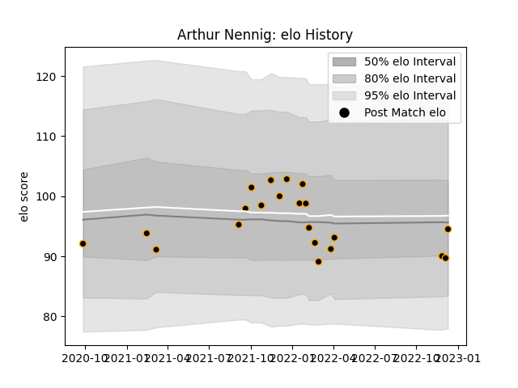

---  
layout: page  
title: Arthur Nennig  
date: 2022-12-09 13:19:45.805156  
categories: player  
---
# Arthur Nennig

## Positions: W

## Current elo: 90.0

## Current Percentile: 25.0

# Elo History

# Match History

| Team     |   Appearances |   Win Rate |
|:---------|--------------:|-----------:|
| Chambery |            20 |       0.35 |

| Opponent                   |   Matches |   Win Rate |
|:---------------------------|----------:|-----------:|
| Dax                        |         3 |   0.333333 |
| Suresnes                   |         3 |   0.666667 |
| Albi                       |         2 |   0        |
| Tarbes                     |         2 |   0.5      |
| Valence Romans Drome Rugby |         2 |   0        |
| Aubenas                    |         1 |   0        |
| Blagnac                    |         1 |   0        |
| Bourgoin-Jallieu           |         1 |   0        |
| Cognac Saint Jean d'Angély |         1 |   1        |
| Dijon                      |         1 |   1        |
| Massy                      |         1 |   0        |
| Nice                       |         1 |   0        |
| Soyaux-Angouleme           |         1 |   1        |