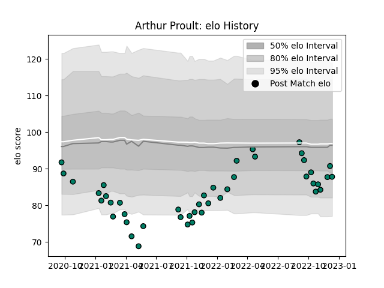

---  
layout: page  
title: Arthur Proult  
date: 2022-12-14 11:34:37.949647  
categories: player  
---
# Arthur Proult

## Positions: C, W

## Current elo: 88.0

## Current Percentile: 30.0

# Elo History

# Match History

| Team     |   Appearances |   Win Rate |
|:---------|--------------:|-----------:|
| Suresnes |            44 |   0.477273 |

| Opponent                   |   Matches |   Win Rate |
|:---------------------------|----------:|-----------:|
| Aubenas                    |         4 |   0.5      |
| Blagnac                    |         4 |   0.25     |
| Cognac Saint Jean d'Angély |         4 |   0.75     |
| Albi                       |         3 |   0.666667 |
| Tarbes                     |         3 |   0.666667 |
| Nice                       |         3 |   0.333333 |
| Narbonne                   |         3 |   0.333333 |
| Dijon                      |         3 |   0.666667 |
| Dax                        |         3 |   0.666667 |
| Valence Romans Drome Rugby |         3 |   0        |
| Massy                      |         2 |   0        |
| Chambery                   |         2 |   0.5      |
| Bourgoin-Jallieu           |         2 |   1        |
| US Bressane                |         2 |   0        |
| Carqueiranne-Hyères        |         1 |   1        |
| Rennes                     |         1 |   1        |
| Soyaux-Angouleme           |         1 |   0        |