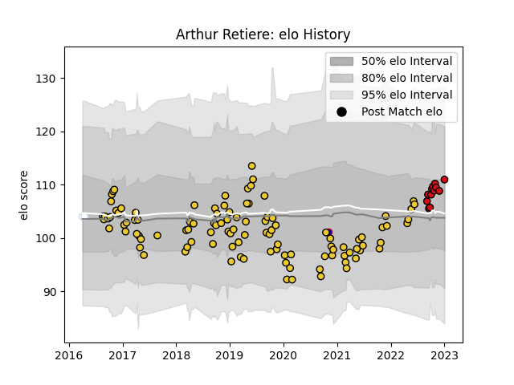

---  
layout: page  
title: Arthur Retiere  
date: 2023-02-02 19:02:27.092085  
categories: player  
---
# Arthur Retiere

## Positions: W, FB

## Country: France

## Current elo: 99.0

## Current Percentile: 57.0

# Elo History

# Match History

| Team             |   Appearances |   Win Rate |
|:-----------------|--------------:|-----------:|
| La Rochelle      |           108 |   0.597222 |
| Stade Toulousain |            15 |   0.7      |
| Racing 92        |             2 |   0.5      |
| France           |             1 |   1        |

| Opponent             |   Matches |   Win Rate |
|:---------------------|----------:|-----------:|
| Toulon               |        10 |   0.75     |
| Stade Toulousain     |        10 |   0.1      |
| Clermont Auvergne    |        10 |   0.35     |
| Stade Francais Paris |        10 |   0.55     |
| Bordeaux Begles      |         9 |   0.777778 |
| Racing 92            |         9 |   0.722222 |
| Pau                  |         8 |   0.75     |
| Montpellier Herault  |         8 |   0.625    |
| Bayonne              |         7 |   0.714286 |
| Lyon                 |         7 |   0.428571 |
| Castres Olympique    |         6 |   0.5      |
| Brive                |         5 |   1        |
| Sale Sharks          |         4 |   0.75     |
| Agen                 |         3 |   0.666667 |
| Grenoble             |         3 |   1        |
| Perpignan            |         3 |   1        |
| Zebre                |         2 |   1        |
| La Rochelle          |         2 |   0.5      |
| Gloucester Rugby     |         2 |   0.5      |
| Exeter Chiefs        |         2 |   0        |
| Benetton Treviso     |         2 |   1        |
| Scarlets             |         1 |   0        |
| Edinburgh            |         1 |   1        |
| Bristol Rugby        |         1 |   0        |
| Ireland              |         1 |   1        |