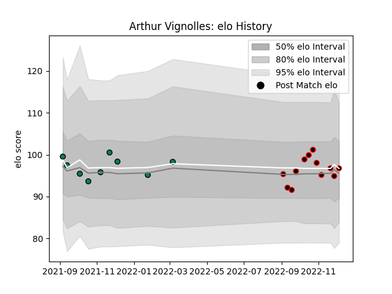

---  
layout: page  
title: Arthur Vignolles  
date: 2023-01-15 11:52:46.249455  
categories: player  
---
# Arthur Vignolles

## Positions: FL, N8

## Current elo: 100.0

## Current Percentile: 50.0

# Elo History

# Match History

| Team     |   Appearances |   Win Rate |
|:---------|--------------:|-----------:|
| Nice     |            14 |   0.392857 |
| Suresnes |            13 |   0.538462 |

| Opponent                   |   Matches |   Win Rate |
|:---------------------------|----------:|-----------:|
| Albi                       |         3 |   0.166667 |
| Blagnac                    |         3 |   0.666667 |
| Dax                        |         3 |   0.333333 |
| Bourgoin-Jallieu           |         2 |   0.5      |
| Chambery                   |         2 |   0        |
| Cognac Saint Jean d'Angély |         2 |   1        |
| Narbonne                   |         2 |   0        |
| Tarbes                     |         2 |   1        |
| Valence Romans Drome Rugby |         2 |   0        |
| Aubenas                    |         1 |   1        |
| Dijon                      |         1 |   1        |
| Rennes                     |         1 |   1        |
| Soyaux-Angouleme           |         1 |   0        |
| Suresnes                   |         1 |   1        |
| US Bressane                |         1 |   0        |