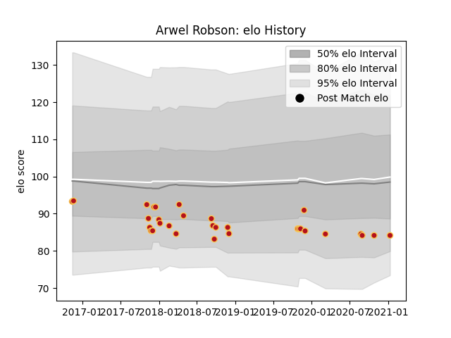

---  
layout: page  
title: Arwel Robson  
date: 2023-01-13 11:31:50.989465  
categories: player  
---
# Arwel Robson

## Positions: FH

## Current elo: 84.0

## Current Percentile: None

# Elo History

# Match History

| Team    |   Appearances |   Win Rate |
|:--------|--------------:|-----------:|
| Dragons |            31 |   0.290323 |

| Opponent           |   Matches |   Win Rate |
|:-------------------|----------:|-----------:|
| Scarlets           |         5 |   0.4      |
| Leinster           |         4 |   0        |
| Benetton Treviso   |         3 |   0        |
| Ospreys            |         3 |   0.166667 |
| Edinburgh          |         2 |   0.5      |
| Glasgow Warriors   |         2 |   0.5      |
| RC Enisei          |         2 |   1        |
| Ulster             |         2 |   0.25     |
| Zebre              |         2 |   0.5      |
| Cheetahs           |         1 |   0        |
| Leicester Tigers   |         1 |   0        |
| Munster            |         1 |   0        |
| Newcastle Falcons  |         1 |   0        |
| Northampton Saints |         1 |   0        |
| Southern Kings     |         1 |   1        |