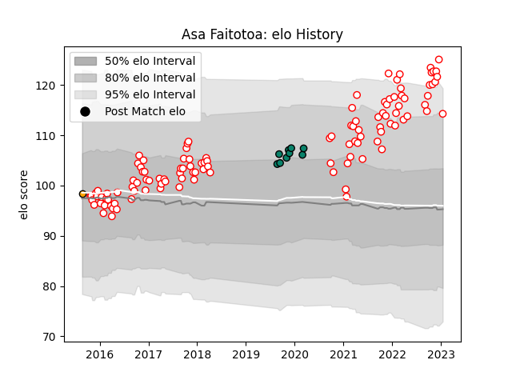

---  
layout: page  
title: Asa Faitotoa  
date: 2023-03-17 17:20:50.213550  
categories: player  
---
# Asa Faitotoa

## Positions: P

## Current elo: 115.0

## Current Percentile: 94.0

# Elo History

# Match History

| Team               |   Appearances |   Win Rate |
|:-------------------|--------------:|-----------:|
| Dax                |           121 |   0.466942 |
| Montauban          |             9 |   0.222222 |
| NSW Country Eagles |             1 |   1        |

| Opponent                   |   Matches |   Win Rate |
|:---------------------------|----------:|-----------:|
| Albi                       |         9 |   0.166667 |
| Bourgoin-Jallieu           |         7 |   0.571429 |
| Carcassonne                |         7 |   0.142857 |
| Blagnac                    |         6 |   0.5      |
| Tarbes                     |         6 |   0.5      |
| Mont-de-Marsan             |         6 |   0.166667 |
| Cognac Saint Jean d'Angély |         5 |   0.4      |
| Suresnes                   |         5 |   0.6      |
| Narbonne                   |         5 |   0.6      |
| Aurillac                   |         5 |   0.4      |
| Montauban                  |         5 |   0.4      |
| Beziers                    |         5 |   0.4      |
| Biarritz Olympique         |         5 |   0.4      |
| Chambery                   |         5 |   1        |
| Soyaux-Angouleme           |         5 |   0.4      |
| Massy                      |         4 |   0        |
| Dijon                      |         4 |   0.75     |
| Perpignan                  |         3 |   0.666667 |
| Colomiers                  |         3 |   0.333333 |
| Oyonnax                    |         3 |   0.333333 |
| US Bressane                |         3 |   0.666667 |
| Valence Romans Drome Rugby |         3 |   0.666667 |
| Nevers                     |         3 |   0.333333 |
| Nice                       |         3 |   1        |
| Vannes                     |         2 |   0.5      |
| Grenoble                   |         2 |   0        |
| Bayonne                    |         2 |   0        |
| Aubenas                    |         2 |   0.5      |
| Lyon                       |         1 |   0        |
| Provence Rugby             |         1 |   1        |
| Rennes                     |         1 |   1        |
| Rouen                      |         1 |   1        |
| Roval Drome XV             |         1 |   1        |
| Greater Sydney Rams        |         1 |   1        |
| Carqueiranne-Hyères        |         1 |   1        |
| Agen                       |         1 |   0        |