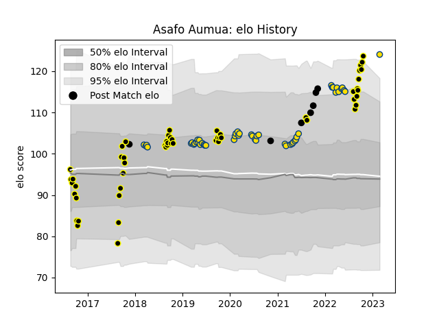

---  
layout: page  
title: Asafo Aumua  
date: 2023-03-16 21:08:34.957485  
categories: player  
---
# Asafo Aumua

## Positions: H

## Country: New Zealand

## Current elo: 123.0

## Current Percentile: 96.0

# Elo History

# Match History

| Team        |   Appearances |   Win Rate |
|:------------|--------------:|-----------:|
| Wellington  |            53 |   0.698113 |
| Hurricanes  |            51 |   0.656863 |
| New Zealand |             7 |   0.714286 |

| Opponent                 |   Matches |   Win Rate |
|:-------------------------|----------:|-----------:|
| Crusaders                |         8 |   0.25     |
| Blues                    |         8 |   0.5      |
| Highlanders              |         7 |   1        |
| Chiefs                   |         6 |   0.583333 |
| Northland                |         6 |   0.833333 |
| Waikato                  |         6 |   0.5      |
| Canterbury               |         5 |   0.6      |
| Otago                    |         5 |   0.8      |
| Taranaki                 |         4 |   0.75     |
| Tasman                   |         4 |   0.25     |
| North Harbour            |         4 |   0.5      |
| Southland                |         4 |   1        |
| Auckland                 |         4 |   0.5      |
| Melbourne Rebels         |         4 |   1        |
| Counties Manukau         |         3 |   1        |
| Sharks                   |         3 |   1        |
| Hawke's Bay              |         3 |   1        |
| Manawatu                 |         3 |   0.666667 |
| Sunwolves                |         2 |   1        |
| Queensland Reds          |         2 |   1        |
| Western Force            |         2 |   0.5      |
| New South Wales Waratahs |         2 |   1        |
| Jaguares                 |         2 |   0.5      |
| Bay of Plenty            |         2 |   1        |
| Moana Pasifika           |         1 |   0        |
| Italy                    |         1 |   1        |
| France                   |         1 |   1        |
| South Africa             |         1 |   0        |
| Fijian Drua              |         1 |   1        |
| Stormers                 |         1 |   0        |
| Bulls                    |         1 |   1        |
| Brumbies                 |         1 |   0        |
| Tonga                    |         1 |   1        |
| United States of America |         1 |   1        |
| Australia                |         1 |   0        |
| Argentina                |         1 |   1        |