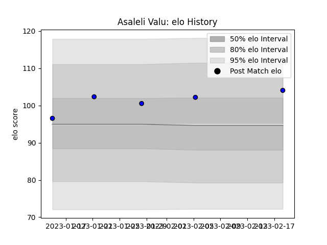

---  
layout: page  
title: Asaleli Valu  
date: 2023-02-24 02:32:20.702616  
categories: player  
---
# Asaleli Valu

## Positions: P

## Current elo: 104.0

## Current Percentile: 75.0

# Elo History

# Match History

| Team                 |   Appearances |   Win Rate |
|:---------------------|--------------:|-----------:|
| Saitama Wild Knights |             5 |          1 |

| Opponent                 |   Matches |   Win Rate |
|:-------------------------|----------:|-----------:|
| Black Rams Tokyo         |         1 |          1 |
| Green Rockets Tokatsu    |         1 |          1 |
| Hanazono Kintetsu Liners |         1 |          1 |
| Toyota Verblitz          |         1 |          1 |
| Yokohama Canon Eagles    |         1 |          1 |