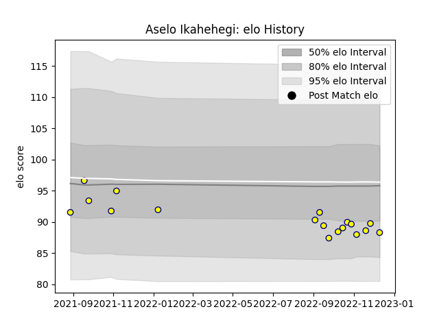

---  
layout: page  
title: Aselo Ikahehegi  
date: 2022-12-14 11:17:37.134007  
categories: player  
---
# Aselo Ikahehegi

## Positions: P

## Current elo: 88.0

## Current Percentile: 17.0

# Elo History

# Match History

| Team   |   Appearances |   Win Rate |
|:-------|--------------:|-----------:|
| Nevers |            18 |   0.388889 |

| Opponent           |   Matches |   Win Rate |
|:-------------------|----------:|-----------:|
| Vannes             |         3 |   0.333333 |
| Aurillac           |         2 |   0.5      |
| Mont-de-Marsan     |         2 |   0        |
| Bayonne            |         1 |   0.5      |
| Beziers            |         1 |   0        |
| Biarritz Olympique |         1 |   0.5      |
| Carcassonne        |         1 |   0        |
| Colomiers          |         1 |   0        |
| Grenoble           |         1 |   0        |
| Massy              |         1 |   1        |
| Oyonnax            |         1 |   0        |
| Provence Rugby     |         1 |   1        |
| Rouen              |         1 |   1        |
| Soyaux-Angouleme   |         1 |   1        |